# 22-23秋 国科大操作系统高级教程课程笔记

## 思考题

1. 为什么开始启动计算机的时候, 执行的是BIOS代码而不是操作系统自身的代码?

## x86架构基础知识

### 架构

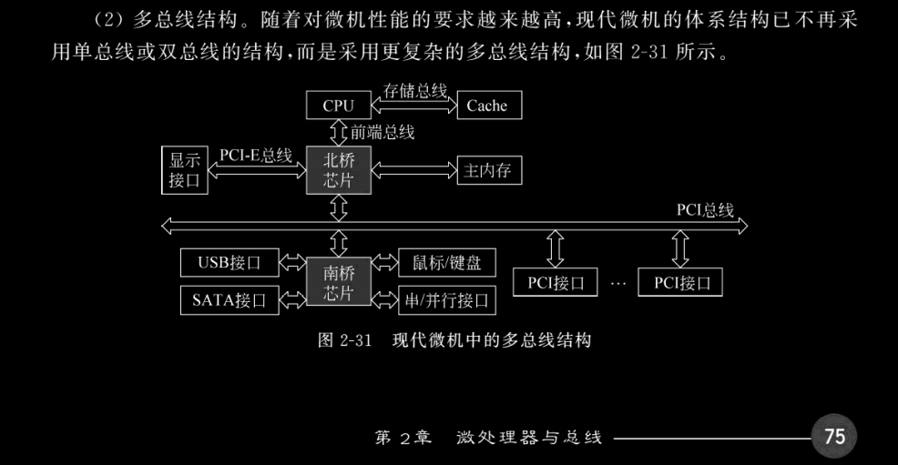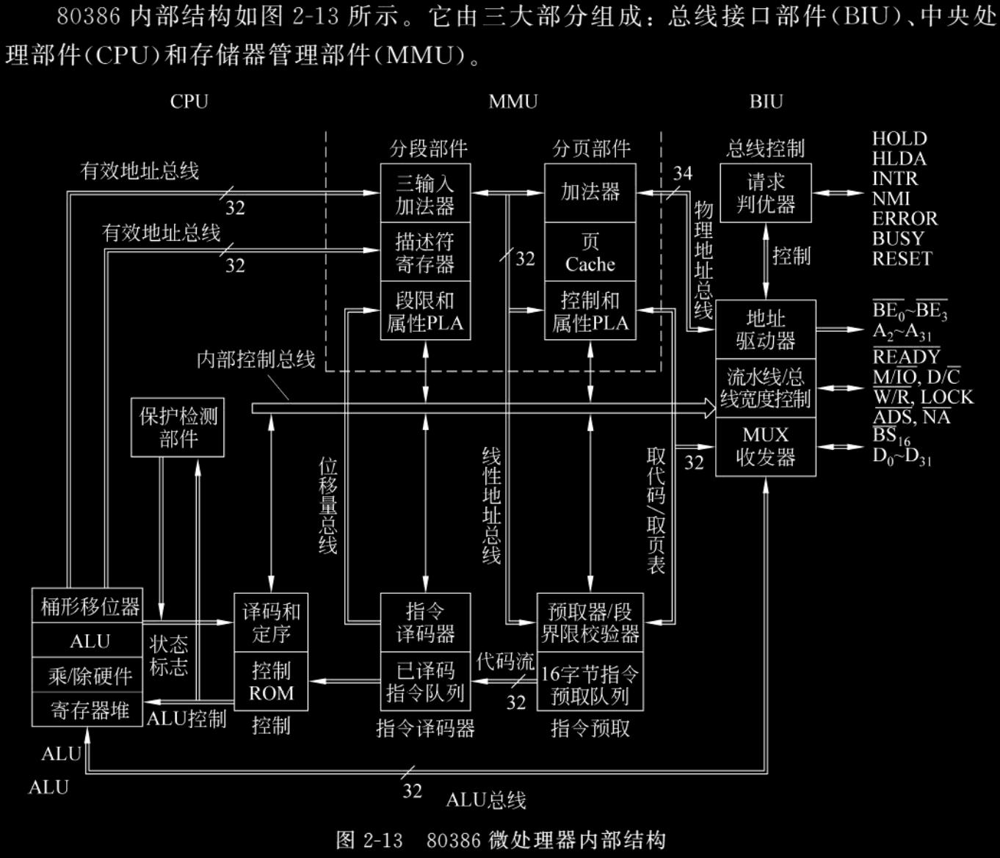

### 寄存器

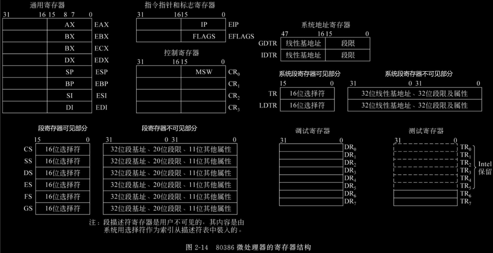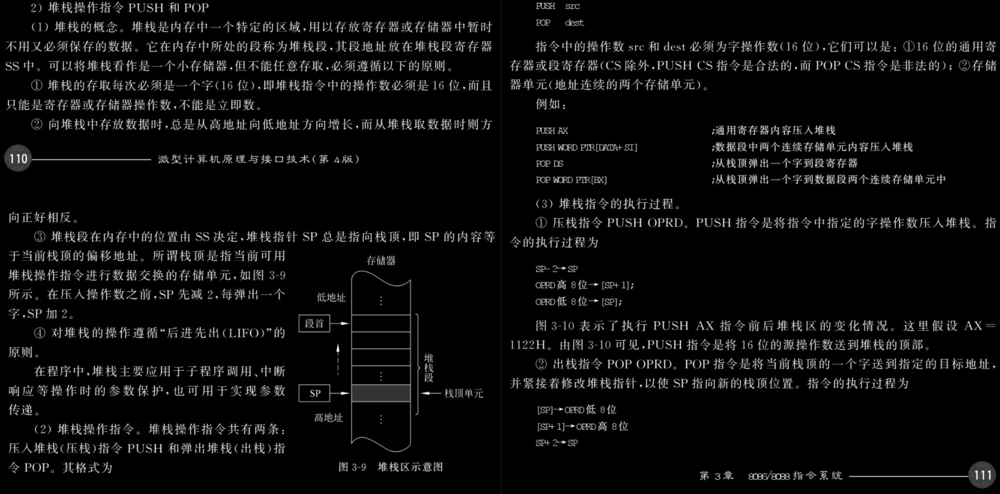

- 栈由高地址向低地址生长
- **SP** (Stack Pointer): 栈顶指针寄存器
- **CS** (Code Segment Register): 代码段寄存器, 在CPU中, 记录当前执行代码段在内存中起始位置
- **IP** (Instruction Pointer): 指令指针寄存器, 记录将要执行的指令在代码段中偏移地址. `CS<<4+IP`即下一条执行的指令的内存地址. 实模式下IP为16位, 保护模式下为EIP, 32位线性地址.
- **GDTR**: GDT基地址寄存器. GDT可以存放在内存任何位置, 操作系统对GDT初始化后用`LGDT`指令将GDT基地址加载到GDTR, 通过GDTR维护其基地址.
- **IDTR**: IDT基地址寄存器. 同理IDT也可以在内存任何位置.
- **段寄存器**: 段寄存器有对用户可见和不可见两部分 (不可见部分也被称为段描述符寄存器/描述符高速缓存等), 当段选择子被装载到段寄存器段可见部分时, 处理器也将段选择子指向的段描述符装载到不可见部分. 段寄存器保存的信息使得处理器在进行地址转换时不需要花费额外的总线周期来从段描述符中获取段基地址及段界限.
	- 💡ES, FS, GS是为当前执行程序/任务提供的额外数据段的段寄存器

### 内存管理

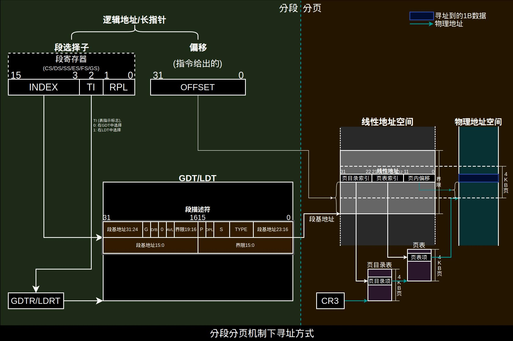

IA-32架构段内存管理分为两部分:
- **分段机制**: 提供了一种将每个进程/任务的*代码*, *数据和栈的模块*隔离开的机制, 保证多个进程/任务能在同一个处理器上运行而不相互干扰.
- **分页机制**: 实现了传统请求调页的虚拟内存系统. 在这种系统中程序的执行环境块按需要被映射到物理内存中.
- 在保护模式下分段机制是必须的, 分页机制是通过一个标志位可选开启的.

#### 段

段用来装载一个程序的代码/数据或堆栈/系统的数据结构 (TSS, LDT等). 段由段描述符定义, 通过段选择子和段描述符访问. 可以定义有很多个段, 但只有段选择子被装载到了段寄存器的段才可以被程序访问到. 分段是历史上为了让程序能够链接子程序 (函数)的方法, 所有程序的设计都是基于段. IA32架构对进程线性地址空间段保护是基于段的, 即==特权级是建立在段上的==.

💡线性地址空间是一维的, 因此我们只需段头和段尾地址就能看护住一个段, 但Intel早期CPU为了降低成本只设计了段头寄存器, 没有段尾寄存器, 为了兼容早期CPU, GDTR, IDTR, 段寄存器不可见部分中包含了限长, 等效于有段尾寄存器了.

IA32架构定义了两个系统段: TSS (Task State Stack, 任务状态段), LDT (Local Descriptor Table, 局部描述符表). ==GDT, IDT不是段==, 因为没有定义GDT, IDT的段描述符, 也不是通过段选择子与段描述符访问的.

- **GDT** (Global Descriptor Table): 全局描述符表, 系统中唯一存放段寄存器内容 (段描述符) 的数组
  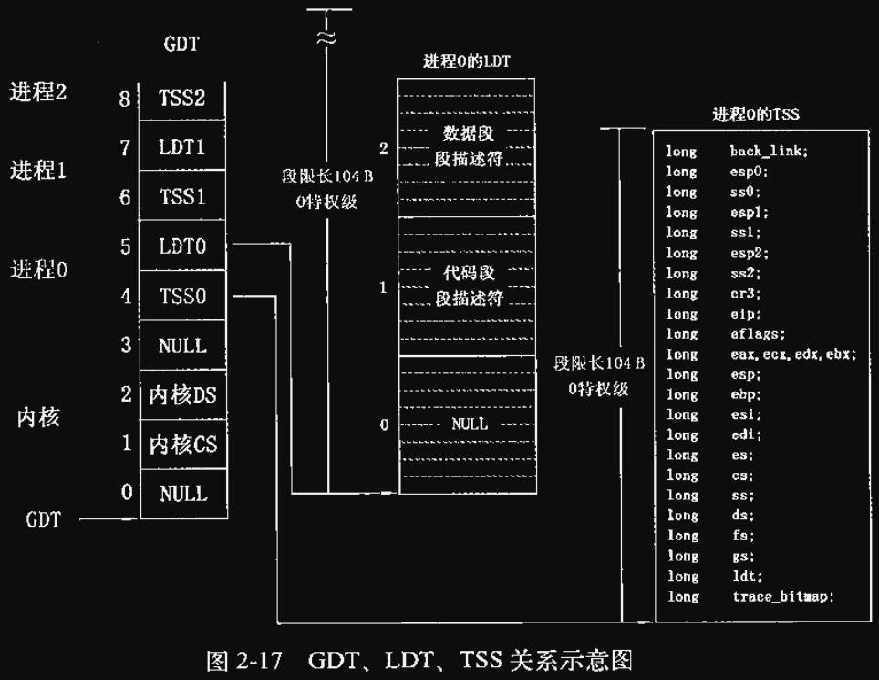
- **IDT** (Interrupt Descriptor Table): 中断描述符表, 保存保护模式下所有中断服务程序的入口地址, 类似实模式下中断向量表.
- 高版本系统中每个进程独占一个线性地址空间, 因此不再需要LDT, 只需要使用GDT. 同时切换进程时需要切换页目录表, 一个页目录表不再足以维护==TODO==

### 保护模式

- 16位变32位
- 寻址方式: 分段->线性地址->(分页)
- 打开保护模式后除了CR3, 页目录表, 页表中存有物理地址, 其他地方使用的都是线性地址, 从线性地址到物理地址的转换是由MMU根据页目录表, 页表, 页的设置由硬件自动完成的.
- 内存管理-分段分页机制:
	- 分页机制是为了实现**请求调页虚拟内存**. 开启分页后, 当一个程序/任务引用内存中一个逻辑地址时, 处理器首先将其转换为线性地址, 然后
	
	  段通常与所保存的代码或数据结构大小一致, 如果只使用分段进行地址转换则一个数据结构必须全部保存在物理内存中. 而页有固定大小 (4KB/4MB/..., 4KB最常见), 可以将一个数据结构部分存在内存中, 部分存在硬盘中. 这让虚拟内存大小不完全受制于物理内存大小.

### 常用数值
- 1KB: 0X400
- 4KB: 0X1000

## 操作系统授权体系的设计指导思想

### 公理化操作系统

#### 术语

- **亚里士多德的直言三段论**

  三段论是演绎推理中一种简单推理判断, 包含大前提, 小前提, 结论三部分. 全集为真则子集为真.

- **证明**

  由公理经由可靠的论证 (如三段论) 推出命题.

- **公理, 公设**

  公理是不证自明 (目前无法举出反例) 的一个命题, 是推导其他命题的起点. 在传统逻辑中, 公设是在一特定数学理论中的定义性的性质. 公设并不是不证自明的命题, 而是在构建一个数学理论的过程中被用来推导的一个形式逻辑表达式. 而在近代, *公理和公设不再有区别*. 在一个公理化体系中所有其他命题都必须由公理证明.

- **科学**

  科学的范畴是可观察范围内, 科学的标准是**可证伪** (因为无法直接获得真理, 科学无法证实). 而数学不可观察, 可证实 (基于公理),  因此不算在科学范畴内.

### 操作系统的内核

#### 操作系统为什么一定要有内核

现代操作系统是**多用户, 实时, 多任务**的, 访问应当经过授权.

> **授权**: 未经许可不得访问其他用户的资源.

- **用户**: shell绑定的是用户, 包括文件, 进程, 外设等很多东西
- **资源**: 包括主机上的 (数据, 代码, 进程), 外设 (显示器, 键盘等)
- 授权是面向访问的, 一项访问一项授权
- 授权有三要素: 用户, 操作,  数据 (一次访问所需信息至少包括这三项, 也可以有更多信息, 比如时间), 单独任意一项都无法完全限定一次访问的权限, 如授权A用户读取X文件的权限, 授权B用户读写X文件的权限.

操作系统应当尽可能赋予用户操作的自由, 因此用户代码会具有不确定性 (不确定会对什么数据/代码做什么), 为了保证所有访问都是经过授权的, 要求:

- 未经许可用户不得访问外设中自己的资源, 因为同一外设端口下可能有其他用户的资源 (比如同一硬盘中有多个用户的数据)
  - 💡现有体系结构中访问外设有两种方式:
    1. IO指令: 较老, 新处理器中基本弃用这种方式. 禁止非特权用户使用, 剥夺普通用户IO能力
    2. MMIO (内存映射): 仅将合法资源映射到内存中用户能访问到的部分
- 同一用户两进程间不共享资源 (历史上先有程序概念后有用户概念, 为保兼容性, 权限管理以进程为单位而不是以用户为单位)

然而如此一来违背了"用户访问自己的资源无需授权"的设想, 因此引入一组由授权体系设计者实现的确定的程序, 即**内核**来代替用户完成访问. 此处的确定指访问的过程和对象都确定.

#### 为什么要有特权级

- **特权级建立在线性地址空间中的代码段上**
  - ==特权本质上是对访问的控制==
  - **虚拟地址空间**: CPU可访问地址空间, intel称**线性地址空间**
  - 访问控制技术都是施加在线性地址层面的, 因此段的地址都是线性空间地址

- 一共有四种情况: (在只有两种特权级的系统中0特权级/3特权级也称内核态/用户态)

  | 发起者    | 操作 | 对象      |
  | --------- | ---- | --------- |
  | 0特权指令 | 访问 | 0特权数据 |
  | 0特权指令 | 跳转 | 0特权指令 |
  | 3特权指令 | 访问 | 3特权数据 |
  | 3特权指令 | 跳转 | 3特权指令 |

  0特权指令*直接*跳转到3特权指令不被允许, 否则若特权级不变, 内核与应用程序就混淆起来了.

#### 内核为什么一定要有结构

> **接续访问机制**: 用户发起 -> 内核接续 (IO操作) -> 交付用户

- **内核是应用程序访问的延续**, 所有访问都由应用程序发起
  - 一次访问至少需要至少包含用户, 操作, 数据三项在内的各种信息
  - 访问种类过多, 因此应当预先设定好一组服务

- **intel的门机制**: 为确保由用户接续到内核过程中状态翻转的确定性, 要求指令确定, 跳转地址确定.

  若跳转地址不确定, 可以直接跳转到内核函数代码段进行特权级操作. 返回的跳转地址也确定 (跳转指令的下一条)

接续访问的重要保障是能在内核态与用户态间借由一些硬件机制建起"一道墙" (进程管理信息数据结构), 确保用户态与内核态的隔离, 但内核可以借助这些机制"建墙"理论上用户就可以利用这些机制"拆墙". 这里利用**时间的不可逆实现空间的不可逆**. 由"拆墙需要为内核态, 想成为内核态需要先拆墙"互为必要条件锁死, 最先创建的用户会具有完全权限, 0特权级.

## 从开机到执行main的过程

从按下开机键到执行32位main函数分下面标题的三步准备工作. 准备工作完成后内存分布如图所示.
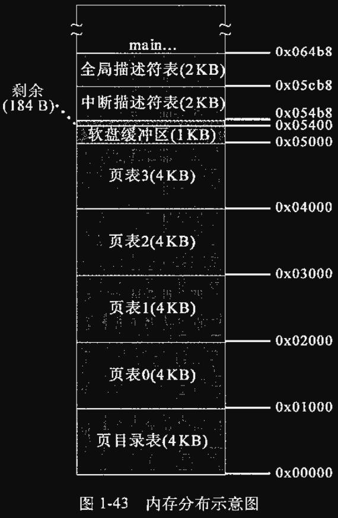

### 启动BIOS, 准备实模式下的中断向量表和中断服务程序

CPU的逻辑电路被设计为只能运行内存中的程序, 因此加电瞬间intel80x86系列CPU进入16位实模式, `CS:IP`被**硬件**强制置为`0xFFFF0` (CS<<4+IP), 即BIOS程序此时在内存中的入口地址, 从而开始执行BIOS程序.

💡实模式有20位存储器地址空间, 即1MB内存可被寻址 (按字节), 按**物理地址**寻址.

站在操作系统角度BIOS最重要的功能就是==将操作系统最开始执行的程序 (通常是引导程序) 加载到内存并跳转执行, 从而进入操作系统自己的启动流程==. BIOS程序构建中断向量表, 加载中断服务程序, 然后硬件触发BIOS提供的中断`int 0x19`加载**bootsect**引导程序到内存中[约定地址](https://www.ruanyifeng.com/blog/2015/09/0x7c00.html)`0X07C00` (BOOTSEG), 然后开始执行位于`0X07C00`的bootsect (对应*boot/bootsect.s*).

💡`int 0x19`的唯一作用就是将软盘第一扇区512B的内容复制到内存`0X07C00`处.

💡BIOS创建的中断向量表 (`0X00000`~`0X003FF`) 及加载的中断服务程序 (`0x0E05B`~`0X0FFFE`) 在**setup**程序将120KB的system模块 (**head**程序及以main函数开始的内核程序) 复制至内存起始位置时被覆盖.

### 从启动盘加载操作系统程序到内存并为保护模式做准备

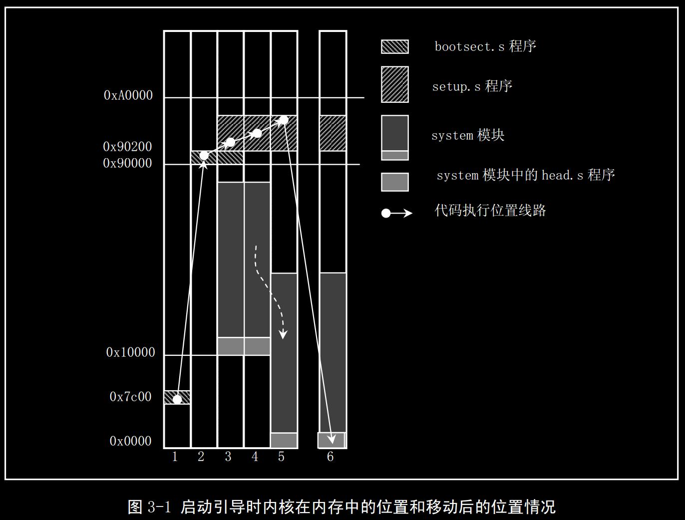

**bootsect**程序最主要作用是将**setup**程序和system模块加载到内存中. 上图中代码在内存中移动的一些解释:
- **bootsect**程序通过触发BIOS提供的中断`int 0x13`将指定扇区内容加载到内存指定位置 (通过设置寄存器的值来传参)
- **bootsect**程序一开始先将自己移动到`0X90000`是因为当时system模块长度不会超过`0X80000`字节 (在Linux0.11中只有120KB), 因此从`0X07C00`移动到`0X90000`能保证**bootsect**程序不会被自己加载的system模块覆盖.
- system模块一开始被**bootsect**程序加载到`0X10000`而不是内存起始位置是因为只有使用BIOS提供的中断`int 0x13`才能从软盘读取system模块所在扇区, 使用指令无法操作外部设备, 而直接将system模块加载到内存起始位置会导致BIOS的中断向量表和中断服务程序被覆盖, 无法再加载system模块. 因此只能先将system模块加载至内存中别的地方, 再在关掉中断后用指令将system模块挪到内存起始位置.

**setup**程序在一开始利用BIOS提供的中断提取到了一些机器信息存放至内存`0X90000`~`0X901FC`, 基本覆盖了**bootsect**程序. 这之后就不再用到BIOS提供的中断服务程序, 甚至关闭中断, 覆盖掉了BIOS的中断向量表和中断服务程序.

### 为执行32位的main函数做准备

因为将system模块挪至内存起始位置会覆盖掉BIOS的中断向量表和中断服务程序, 为了避免问题**setup**程序先用`cli`将CPU的EFLAGS中中断允许标志 (IF) 置为0==关闭了中断==, 然后才将system模块挪至内存起始位置.

GDT IA32 49页, 第0个为NULL

内核态与用户态的内存分页管理方式是不同的, 内核态的线性地址空间与物理地址空间是直接映射的, 内核可以直接获得物理地址, 而用户态线性地址与物理地址映射没有规律. 这样用户程序就无法根据线性地址推算对应物理地址, 使得内核能访问用户程序而用户程序无法访问其他用户的程序, 同时权限限制了用户程序无法访问内核内存空间 (其中是内核代码及数据).

历史上由于函数 (子程序) 链接的需要, 发明了内存分段机制, 所有程序的设计都是基于段的.

## 设备环境初始化

GDT不能称为段, 因为没有描述符用于描述GDT. ==但GDT本身确实在GDT的第二个?==

- 保护模式是什么

进程不会直接读写硬盘, 而是读写的内存中的缓冲区, 而缓冲区与硬盘间有同步机制. 进程并不知道数据何时被写到硬盘.

每个进程有个用户栈, 也有个内核栈.

为了在线性地址层面分隔进程的内存空间, Linux0.11的策略是将4GB线性地址空间分为互不重叠的64等份 (每份64MB), 每个进程一份, 最多同时维护64个进程. 通过硬件禁止进程进行越界访问, 实现在线性地址层面对进程内存空间的保护.

所有进程的登记, 注销都在`task[64]`维护.

[进程地址空间](https://blog.csdn.net/icandoit_2014/article/details/56666569)
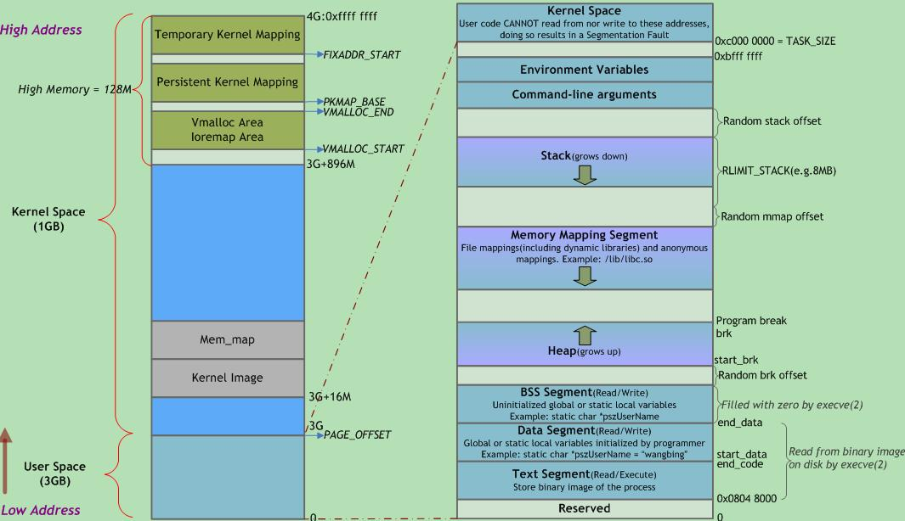

在进程0之前的内存是各种全局变量, 是内核的公共部分. 可以看作各个进程都可以向这里 (比如buffer_head) 读写.

## 进程0创建进程1

`fork()`中触发`int $80`软中断系统门前都是3特权, 这之后进入进程0的内核栈, 栈被硬件压到了内核栈, 这样到时候才能从进程0内核栈返回.

## 进程1的执行

硬盘读写缓冲的存在是为了快, 之所以能快是因为可能有多个进程对硬盘读写, 映射到内存的缓冲区能被复用. 如果没有被复用, 反而会更慢些. 因此缓冲区设计的核心有二:
1. 追求**高命中率**, 这样才能最大程度复用. 通过==使已经进入缓冲区的数据停留尽可能久==实现
2. 要求**高一致性**, 在进程的内存空间和硬盘之间多了一个缓冲区, 则要求缓冲区能与两者具有高一致性

从硬盘读取新的块一定是先在缓冲区建立对应的缓冲块, 然后从硬盘将数据读到缓冲块, 然后从缓冲区读到内存. 整个同步过程都加锁, 禁止进程读写

pause() -> int80 -> sys_pause() -> schedule() -> switch_to() -> ljmp行后切换进程, 或switch_to当前进程, 直接跳出. 切换到的进程一定是之前挂起, 停在了ljmp下一行

### bread()
进程1在`bread()`中在执行`ll_rw_block()`调用内核读盘后会进入`wait_on_buffer()` , 在`sleep_on()`中尝试是否调度到其他进程. 如果还在等待硬盘,  进程1处于挂起状态, 此时再没有除了进程0的其他进程, 因此切到进程0, 循环`for(;;){pause();}`这段

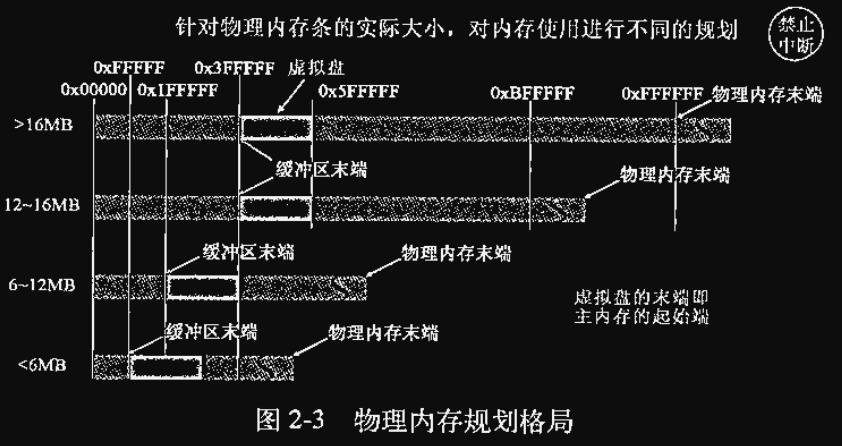

写硬盘时改写需要缓冲块与硬盘块的一致性, 新写不需要一致性 (反正会覆盖掉硬盘块的内容)

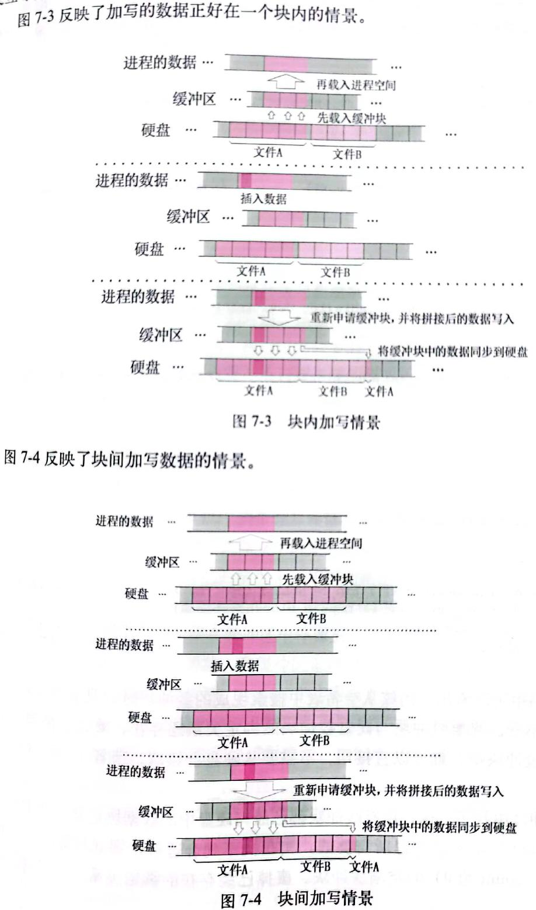

## 等待队列

`bread()`中`wait_on_buffer()`里的`bh->b_wait`

两个进程在等同一个块, 则`b_wait`就是同一个.

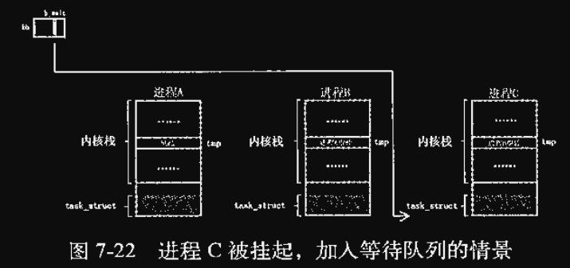

中断的意义: 摆脱轮询, 允许切换到其他任务, **主动激励, 被动响应**.

请求项的队列是一类设备在一个队列, 但是都在request列表

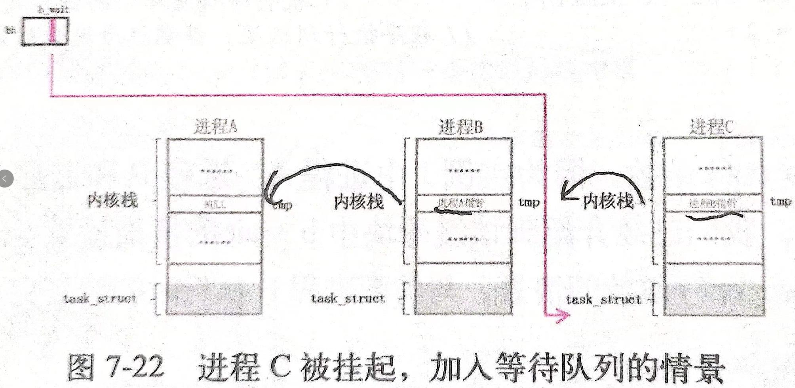
