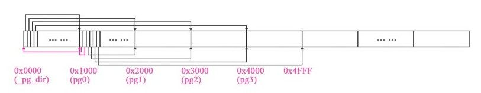
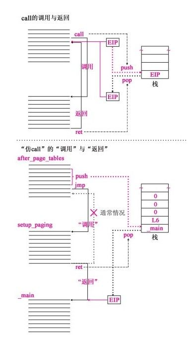
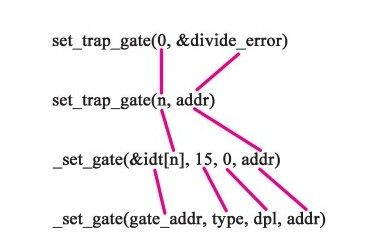
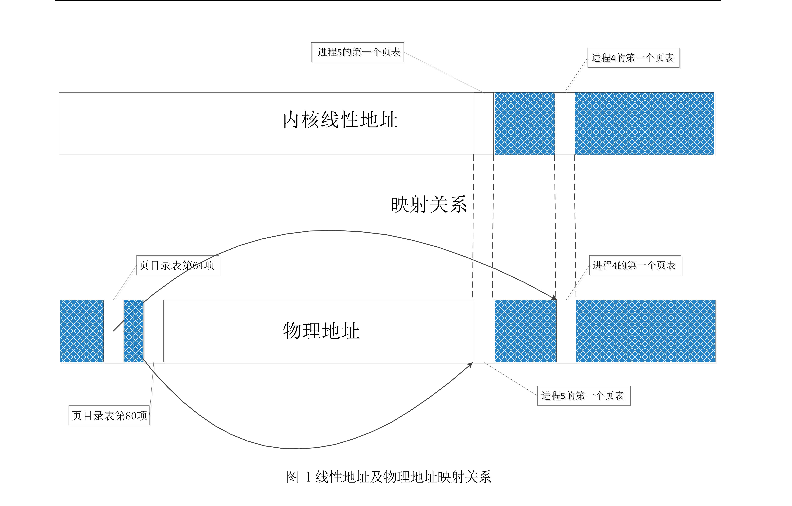
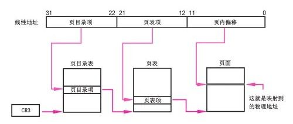

 思考题

### 1.为什么开始启动计算机的时候，执行的是BIOS代码而不是操作系统自身的代码？

计算机被设计为从内存中运行程序，无法直接从软盘或者硬盘中运行。最开始启动计算机的时候，计算机内存未初始化，没有任何程序。而因为CPU只能读取内存中的程序，所以必须将操作系统先加载进内存当中。需要使用BIOS。在加电后， BIOS 需要完成一些硬件检测工作，同时设置实模式下的中断向量表和服务程序，并将操作系统的引导扇区加载至 0x7C00 处，然后将跳转至 0x7C00运行操作系统自身的代码。BIOS程序存放在ROM中，ROM断电后也能保持信息，但一被烧就不能改变数据，适合存放BIOS这种不需要修改的例行工作。所以计算机启动最开始运行的是BIOS代码。

### 2.为什么BIOS只加载了一个扇区，后续扇区却是由bootsect代码加载？为什么BIOS没有直接把所有需要加载的扇区都加载？

BIOS和操作系统的开发通常是不同的团队，按固定的规则约定，可以进行灵活的各自设计相应的部分。BIOS接到启动操作系统命令后，只从启动扇区将代码加载至0x7c00(BOOTSEG)位置，而后续扇区由bootsect代码加载，这些代码由编写系统的用户负责，与之前BIOS无关。这样构建的好处是站在整个体系的高度，统一设计和统一安排，简单而有效。这样构建的好处是站在整个体系的高度，统一设计和统一安排，简单而有效。BIOS和操作系统的开发都可以遵循这一约定，灵活地进行各自的设计。例如，BIOS可以不用知道内核镜像的大小以及其在软盘的分布等等信息，减轻了BIOS程序的复杂度，降低了硬件上的开销。而操作系统的开发者也可以按照自己的意愿，内存的规划，等等都更为灵活。另外，如果要使用BIOS进行加载，而且加载完成之后再执行，则需要很长的时间，此外，对于不同的操作系统，其代码长度不一样，可能导致操作系统加载不完全。因此Linux采用的是边执行边加载的方法。

### 3.为什么BIOS把bootsect加载到0x07c00，而不是0x00000？加载后又马上挪到0x90000处，是何道理？为什么不一次加载到位？

加载0x07c00是BIOS提前约定设置的，不能加载到0x00000是因为从0x00000开始到0x003ff这1KB内存空间都是BIOS首先约定进行加载[中断](https://so.csdn.net/so/search?q=%E4%B8%AD%E6%96%AD&spm=1001.2101.3001.7020)向量表的地方，不能进行覆盖。

（1）加载0x07c00是BIOS提前约定设置的，BIOS把bootsect加载到0x07c00而不是0x00000，是因为0x00000处存放着BIOS构建的1k大小的中断向量表和256B的BIOS数据区，这些数据还有用处，不能进行覆盖。

（2）加载后又挪到0x90000是因为，操作系统对内存的规划是在0x90000存放bootsect，然后bootsect执行结束之后，立即将系统机器数据存放在此处，这样就可以及时回收寿命结束的程序占据的内存空间。而且后续会把120K的系统模块存放到0x00000处，这会覆盖0x07c00处的代码和数据。
（3）不一次加载到位的原因是由于“两头约定”和“定位识别”，所以在开始时bootsect“被迫”加载到0X07c00位置。现在将自身移至0x90000处，说明操作系统开始根据自己的需要安排内存了。

### 4.bootsect、setup、head程序之间是怎么衔接的？给出代码证据。

① bootsect→setup程序：`jmpi 0,SETUPSEG`;

bootsect首先利用int 0x13中断分别加载setup程序及system模块，待bootsect程序的任务完成之后，执行代码`jmpi 0,SETUPSEG`。由于 bootsect 将 setup 段加载到了 `SETUPSEG:0` `（0x90200）`的地方,在实模式下，CS:IP指向setup程序的第一条指令，此时setup开始执行。

② setup→head程序：`jmpi 0,8`

执行setup后，内核被移到了0x00000处，系统进入了保护模式，执行`jmpi 0,8`

并加载了中断描述符表和全局描述符表`lidt idt_48；1gdt gdt_48`。在保护模式下，一个重要的特征就是根据GDT决定后续执行哪里的程序。该指令执行后跳转到以GDT第2项中的 base_addr 为基地址，以0为偏移量的位置，其中base_addr为0。由于head放置在内核的头部，因此程序跳转到head中执行。

### 5.setup程序的最后是`jmpi 0,8` ，为什么这个8不能简单的当作阿拉伯数字8看待，究竟有什么内涵？

此时为32位保护模式，“0”表示段内偏移，“8”表示段选择符。这里8要转化为二进制：`1000`,最后两位00表示内核特权级（若是11则表示用户），第三位0表示 GDT 表（若是1则表示LDT表），第四位1表示根据GDT中的第2项来确定代码段的段基址和段限长等信息。可以得到代码是从head 的开始位置，段基址 `0x00000000`、偏移为 0 处开始执行的，即head的开始位置。

### 6.保护模式在“保护”什么？它的“保护”体现在哪里？特权级的目的和意义是什么？分页有“保护”作用吗？

（1） 保护模式在“保护”什么？它的“保护”体现在哪里？

保护操作系统的安全，不受到恶意攻击。保护进程地址空间。

“保护”体现在：打开保护模式后，CPU 的寻址模式发生了变化，基于 GDT 去获取代码或数据段的基址，相当于增加了一个段位寄存器。防止了对代码或数据段的覆盖以及代码段自身的访问超限，明显增强了保护作用。对描述符所描述的对象进行保护：在 GDT、 LDT 及 IDT 中，均有对应界限、特权级等，这是对描述符所描述的对象的保护；在不同特权级间访问时，系统会对 CPL、 RPL、 DPL、 IOPL 等进行检验，同时限制某些特殊指令如 lgdt, lidt,cli 等的使用；分页机制中 PDE 和 PTE 中的 R/W 和 U/S 等提供了页级保护，分页机制通过将线性地址与物理地址的映射，提供了对物理地址的保护。

（2）特权级的目的和意义是什么？

**特权级机制目的是**为了进行合理的管理资源，保护高特权级的段。其中操作系统的内核处于最高的特权级。

**意义是**进行了对系统的保护，对操作系统的“主奴机制”影响深远。Intel 从硬件上禁止低特权级代码段使用部分关键性指令，通过特权级的设置禁止用户进程使用 cli、 sti 等对掌控局面至关重要的指令。有了这些基础，操作系统可以把内核设计成最高特权级，把用户进程设计成最低特权级。这样，操作系统可以访问 GDT、 LDT、 TR，而 GDT、 LDT 是逻辑地址形成线性地址的关键，因此操作系统可以掌控线性地址。物理地址是由内核将线性地址转换而成的，所以操作系统可以访问任何物理地址。而用户进程只能使用逻辑地址。总之，特权级的引入对操作系统内核进行保护。

（3）分页有“保护”作用吗？

分页机制有保护作用，使得用户进程不能直接访问内核地址，进程间也不能相互访问。用户进程只能使用逻辑地址，而逻辑地址通过内核转化为线性地址，根据内核提供的专门为进程设计的分页方案，由MMU非直接映射转化为实际物理地址形成保护。此外，通过分页机制，每个进程都有自己的专属页表，有利于更安全、高效的使用内存，保护每个进程的地址空间。

**为什么特权级是基于段的？（超纲备用）**

在操作系统设计中，一个段一般实现的功能相对完整，可以把代码放在一个段，数据放在一个段，并通过段选择符（包括CS、SS、DS、ES、Fs和GS）获取段的基址和特权级等信息。通过段，系统划分了内核代码段、内核数据段、用户代码段和用户数据段等不同的数据段，有些段是系统专享的，有些是和用户程序共享的，因此就有特权级的概念。特权级基于段，这样当段选择子具有不匹配的特权级时，按照特权级规则评判是否可以访问。特权级基于段，是结合了程序的特点和硬件实现的一种考虑。

### 7.在setup程序里曾经设置过gdt，为什么在head程序中将其废弃，又重新设置了一个？为什么设置两次，而不是一次搞好？

原来GDT所在的位置是设计代码时在setup.s里面设置的数据，将来这个`setup`模块所在的内存位置会在设计缓冲区时被覆盖。如果不改变位置，将来GDT的内容肯定会被缓冲区覆盖掉，从而影响系统的运行。这样一来，将来整个内存中唯一安全的地方就是现在`head.s`所在的位置了。

那么有没有可能在执行setup程序时直接把GDT的内容复制到head.s所在的位置呢？肯定不能。如果先复制GDT的内容，后移动system模块，它就会被后者覆盖；如果先移动system模块，后复制GDT的内容，它又会把head.s对应的程序覆盖，而这时head.s还没有执行。所以，无论如何，都要重新建立GDT。

### 8.进程0的task_struct在哪？具体内容是什么？

进程0的`task_struct`位于内核数据区，因为在进程0未激活之前，使用的是boot阶段的`user_stack`，因此存储在`user_stack`中。
具体内容：包含了进程 0 的进程状态、进程 0 的 LDT、进程 0 的 TSS 等等。其中 ldt 设置了代码段和堆栈段的基址和限长(640KB)，而 TSS 则保存了各种寄存器的值，包括各个段选择符。

代码如下：

```c
//进程0的task_struct的值
/*
 *  INIT_TASK is used to set up the first task table, touch at
 * your own risk!. Base=0, limit=0x9ffff (=640kB)
 */
#define INIT_TASK \
/* state etc */	{ 0,15,15, \
/* signals */	0,{{},},0, \
/* ec,brk... */	0,0,0,0,0,0, \
/* pid etc.. */	0,-1,0,0,0, \
/* uid etc */	0,0,0,0,0,0, \
/* alarm */	0,0,0,0,0,0, \
/* math */	0, \
/* fs info */	-1,0022,NULL,NULL,NULL,0, \
/* filp */	{NULL,}, \
	{ \
		{0,0}, \
/* ldt */	{0x9f,0xc0fa00}, \
		{0x9f,0xc0f200}, \
	}, \
/*tss*/	{0,PAGE_SIZE+(long)&init_task,0x10,0,0,0,0,(long)&pg_dir,\
	 0,0,0,0,0,0,0,0, \
	 0,0,0x17,0x17,0x17,0x17,0x17,0x17, \
	 _LDT(0),0x80000000, \
		{} \
	}, \
}
```

### 9.内核的线性地址空间是如何分页的？画出从0x000000开始的7个页（包括页目录表、页表所在页）的挂接关系图，就是页目录表的前四个页目录项、第一个个页表的前7个页表项指向什么位置？给出代码证据。

**如何分页：**`head.s`在`setup_paging`开始创建分页机制。将页目录表和4个页表放到物理内存的起始位置，从内存起始位置开始的5个页空间内容全部清零（每页4KB），然后设置页目录表的前4项，使之分别指向4个页表。然后开始从高地址向低地址方向填写4个页表，依次指向内存从高地址向低地址方向的各个页面。即将第4个页表的最后一项指向寻址范围的最后一个页面。即从`0xFFF000`开始的4kb 大小的内存空间。将第4个页表的倒数第二个页表项指向倒数第二个页面，即`0xFFF000-0x1000000`开始的4KB字节的内存空间，依此类推。

挂接关系图：



总体效果图

代码证据：注意，页目录表需指向所有页表；页表须要指向所有页；页目录表、页表自己也是页。

```c
//代码路径：boot\head.s
.align 2
setup_paging:
	movl $1024*5,%ecx		/* 5 pages - pg_dir+4 page tables */
	xorl %eax,%eax
	xorl %edi,%edi			/* pg_dir is at 0x000 */
	cld;rep;stosl
	movl $pg0+7,_pg_dir		/* set present bit/user r/w */
	movl $pg1+7,_pg_dir+4		/*  --------- " " --------- */
	movl $pg2+7,_pg_dir+8		/*  --------- " " --------- */
	movl $pg3+7,_pg_dir+12		/*  --------- " " --------- */
	movl $pg3+4092,%edi
	movl $0xfff007,%eax		/*  16Mb - 4096 + 7 (r/w user,p) */
	std
1:	stosl			/* fill pages backwards - more efficient :-) */
	subl $0x1000,%eax
	jge 1b
	xorl %eax,%eax		/* pg_dir is at 0x0000 */
	movl %eax,%cr3		/* cr3 - page directory start */
	movl %cr0,%eax
	orl $0x80000000,%eax
	movl %eax,%cr0		/* set paging (PG) bit */
	ret			/* this also flushes prefetch-queue */
```

### 10.在head程序执行结束的时候，在idt的前面有184个字节的head程序的剩余代码，剩余了什么？为什么要剩余？

在IDT前面有184个字节的剩余代码，剩余内容在0x054b8~0x05400处，包含了after_page_tables、ignore_int中断服务程序和setup_paging设置分页的代码。其中after_page_tables往栈中压入了些参数，ignore_int用做初始化中断时的中断处理函数，setup_paging则是初始化分页。

**剩余的原因：**after_page_tables中压入了一些参数，为内核进入main函数跳转做准备，为了谨慎起见，设计者在栈中压入了L6，以使得系统可能出错时，返回L6处执行；

ignore_int是IDT的默认初始化值，既可以防止无意中覆盖代码或数据而引起的逻辑混乱，也可以对开发过程中的误操作给出及时的提示；setup_paging在分页完成前不能被覆盖。

Ignore_int为中断处理函数，使用ignore_int将idt全部初始化，因此如果中断开启后，可能使用了未设置的中断向量，那么将默认跳转到ignore_int处执行。这样做的好处是使得系统不会跳转到随机的地方执行错误的代码，所以ignore_int不能被覆盖。

setup_paging用于分页，在该函数中对0x0000和0x5000的进行了初始化操作。该代码需要“剩余”用于跳转到main，即执行”ret”指令。

### 11.为什么不用call，而是用ret“调用”main函数？画出调用路线图，给出代码证据。

call指令会将EIP的值自动压栈，保护返回现场，然后执行被调函数的程序，等到执行被调函数的ret 指令时，自动出栈给EIP并还原现场，继续执行call的下一条指令。然而对操作系统的main 函数来说，如果用call 调用main函数，那么ret时返回给谁呢？在由head程序向main函数跳转时，是不需要main函数返回的；同时由于main函数已经是最底层的函数了，没有更底层的支撑函数支持其返回。用ret 实现的调用操作当然就不需要返回了，call做的压栈和跳转动作需要手工编写代码，模仿了call的全部动作，实现了调用setup_paging函数。压栈的EIP值不是调用setup_paging函数的下一行指令的地址，而是操作系统的main函数的执行入口地址，这样当setup_paging函数执行到ret时，从栈中将操作系统的main函数的执行入口地址_main自动出栈给EIP，EIP指向main函数的入口地址,实现了用返回指令调用main函数。所以要达到既调用main又不需返回，就不采用call而是选择了ret“调用”了。



仿call示意图

```c
//代码路径：boot\head.s
after_page_tables:
	pushl $0		# These are the parameters to main :-)
	pushl $0
	pushl $0
	pushl $L6		# return address for main, if it decides to.
	pushl $_main
	jmp setup_paging
L6:
	jmp L6			# main should never return here, but
				# just in case, we know what happens.
```

### 12.用文字和图说明中断描述符表是如何初始化的，可以举例说明（比如：`set_trap_gate(0,&divide_error)`），并给出代码证据。

对中断描述符表的初始化，就是将中断、异常处理的服务程序与IDT进行挂接，逐步重建中断服务体系。

以 `set_trap_gate(0,&divide_error)`为例，其中，n是 0，`gate_addr`是&idt[0]，也就是idt的第一项中断描述符的地址；type 是 15，dpl（描述符特权级）是 0；`addr` 是中断服务程序 `divide_error(void)` 的入口地址。



参数对应示意图

```c
//代码路径：include\asm\system.h
#define set_trap_gate(n,addr) \
	_set_gate(&idt[n],15,0,addr)
#define _set_gate(gate_addr,type,dpl,addr) \
__asm__ ("movw %%dx,%%ax\n\t" \
	"movw %0,%%dx\n\t" \
	"movl %%eax,%1\n\t" \
	"movl %%edx,%2" \
	: \
	: "i" ((short) (0x8000+(dpl<<13)+(type<<8))), \
	"o" (*((char *) (gate_addr))), \
	"o" (*(4+(char *) (gate_addr))), \
	"d" ((char *) (addr)),"a" (0x00080000))
```

刚开始中断服务程序地址&divide_error 存储在edx中，段选择子0008存储在eax的高字，将edx低字赋给eax的低字组成中断描述符表的低32位，0x8000+（dpl<<13）+（type<<8）即二进制1000111100000000是对p位、type位、dpl位的设置，然后赋给edx的低位组成中断描述符表的高32位，最后将edx、eax分别写入中断描述符表的高32位和低32位。

### 13.在IA-32中，有大约20多个指令是只能在0特权级下使用，其他的指令，比如cli，并没有这个约定。奇怪的是，在Linux0.11中，3特权级的进程代码并不能使用cli指令，这是为什么？请解释并给出代码证据。

根据Intel Manual，cli和sti指令与CPL和EFLAGS[IOPL]有关。通过IOPL来加以保护指令in,ins,out,outs,cli,sti等I/O敏感指令，只有CPL(当前特权级)<=IOPL才能执行，低特权级访问这些指令将会产生一个一般性保护异常。IOPL位于EFLAGS的12-13位，仅可通过iret来改变，INIT_TASK中IOPL为0，在move_to_user_mode中直接执行“pushfl \n\t”指令，继承了内核的EFLAGS。IOPL的指令仍然为0没有改变，所以用户进程无法调用cli指令。因此，通过设置 IOPL，3特权级的进程代码不能使用 cli 等I/O敏感指令。

```c
//进程0的task_struct的值
/*
 *  INIT_TASK is used to set up the first task table, touch at
 * your own risk!. Base=0, limit=0x9ffff (=640kB)
 */
#define INIT_TASK \
/* state etc */	{ 0,15,15, \
/* signals */	0,{{},},0, \
/* ec,brk... */	0,0,0,0,0,0, \
/* pid etc.. */	0,-1,0,0,0, \
/* uid etc */	0,0,0,0,0,0, \
/* alarm */	0,0,0,0,0,0, \
/* math */	0, \
/* fs info */	-1,0022,NULL,NULL,NULL,0, \
/* filp */	{NULL,}, \
	{ \
		{0,0}, \
/* ldt */	{0x9f,0xc0fa00}, \
		{0x9f,0xc0f200}, \
	}, \
/*tss*/	{0,PAGE_SIZE+(long)&init_task,0x10,0,0,0,0,(long)&pg_dir,\
	 0,0,0,0,0,0,0,0, \
	 0,0,0x17,0x17,0x17,0x17,0x17,0x17, \
	 _LDT(0),0x80000000, \
		{} \
	}, \
}

//代码路径：include\asm\system.h
#define move_to_user_mode() \
__asm__ ("movl %%esp,%%eax\n\t" \
	"pushl $0x17\n\t" \
	"pushl %%eax\n\t" \
	"pushfl\n\t" \   //eflags进栈
	"pushl $0x0f\n\t" \
	"pushl $1f\n\t" \
	"iret\n" \
	//..
	:::"ax")
```

而进程1在copy_process中TSS里，设置了EFLAGS的IOPL位为0。总之，通过设置IOPL，可以限制3特权级的进程代码使用cli。

```c
//代码路径：kernel\fork.c
int copy_process(int nr,long ebp,long edi,long esi,long gs,long none,
		long ebx,long ecx,long edx,
		long fs,long es,long ds,
		long eip,long cs,long eflags,long esp,long ss)
{
	//…
	p->tss.eip = eip;
	p->tss.eflags = eflags;
	p->tss.eax = 0;
	//…
	return last_pid;
}
```

### 14.进程0的task_struct在哪？具体内容是什么？给出代码证据。

内核数据段。具体内容包括状态、信号、pid、alarm、ldt、tss等管理该进程所需的数据。重复

### 15.在system.h里读懂代码。这里中断门、陷阱门、系统调用都是通过_set_gate设置的，用的是同一个嵌入汇编代码，比较明显的差别是dpl一个是3，另外两个是0，这是为什么？说明理由。

```c
#define _set_gate(gate_addr,type,dpl,addr) \
__asm__ ("movw %%dx,%%ax\n\t" \
    "movw %0,%%dx\n\t" \
    "movl %%eax,%1\n\t" \
    "movl %%edx,%2" \
    : \
    : "i" ((short) (0x8000+(dpl<<13)+(type<<8))), \
    "o" (*((char *) (gate_addr))), \
    "o" (*(4+(char *) (gate_addr))), \
    "d" ((char *) (addr)),"a" (0x00080000))
#define set_intr_gate(n,addr) \
    _set_gate(&idt[n],14,0,addr)
#define set_trap_gate(n,addr) \
    _set_gate(&idt[n],15,0,addr)
#define set_system_gate(n,addr) \
    _set_gate(&idt[n],15,3,addr)
```

set_trap_gate 和set_intr_gate的dpl是3，set_system_gate的dpl是0。dpl为0表示只能在内核态下允许，dpl为3表示系统调用可以由3特权级调用。
当用户程序产生系统调用软中断后， 系统都通过system_call总入口找到具体的系统调用函数。 set_system_gate设置系统调用，须将 DPL设置为 3，允许在用户特权级（3）的进程调用，否则会引发 General Protection 异常。set_trap_gate 及 set_intr_gate 设置陷阱和中断为内核使用，需禁止用户进程调用，所以 DPL为 0。

### 16.进程0 fork进程1之前，为什么先调用move_to_user_mode()？用的是什么方法？解释其中的道理。

Linux规定，除了进程0外，所有进程都要由一个已有的进程在3特权级下创建，进程0此时处于0特权级。按照规定，在创建进程1之前要将进程0转变为3特权级。方法是调用move_to_user_mode()函数，模仿中断返回动作，实现进程0的特权级从内核态转化为用户态。又因为在Linux-0.11中，转换特权级时采用中断和中断返回的方式，调用系统中断实现从3到0的特权级转换，中断返回时转换为3特权级。因此，进程0从0特权级到3特权级转换时采用的是模仿中断返回。设计者首先手工写压栈代码模拟int（中断）压栈，当执行iret指令时，CPU自动将这5个寄存器的值（SS，ESP,EFLAGS，CS，EIP）按序恢复给CPU，CPU就会翻转到3特权级去执行代码。

### 17.在Linux操作系统中大量使用了中断、异常类的处理，究竟有什么好处？

在未引入中断、异常处理类处理理念以前，CPU每隔一段时间就要对全部硬件进行轮询，以检测它的工做是否完成，若是没有完成就继续轮询，这样消耗了CPU处理用户程序的时间，下降了系统的综合效率。可见，CPU以“主动轮询”的方式来处理信号是很是不划算的。采用以“被动模式” 代替“主动轮询” 模式来处理终端问题。进程在主机中运算需用到 CPU，其中可能进行“异常处理”,此时需要具体的服务程序来执行。这种中断服务体系的建立是为了被动响应中断信号。因此,CPU 就可以更高效的处理用户程序服务,不用考虑随机可能产生的中断信号，从而提高了操作系统的综合效率。

### 18.copy_process函数的参数最后五项是：long eip,long cs,long eflags,long esp,long ss。查看栈结构确实有这五个参数，奇怪的是其他参数的压栈代码都能找得到，确找不到这五个参数的压栈代码，反汇编代码中也查不到，请解释原因。

copy_process执行是因为进程调用了fork函数创建进程，会执行“int 0x80”产生一个软中断，中断使CPU硬件自动将ss,esp,eflags,cs,eip这5个寄存器的值按顺序压入进程0内核栈，又因为函数传递参数是使用栈的，所以刚好可以作为copy_process的最后五个参数。

### 19.分析get_free_page()函数的代码，叙述在主内存中获取一个空闲页的技术路线。

通过逆向扫描页表位图 mem_map，找到内存中（从高地址开始）第一个空闲（字节为0）页面，将其置为1。ecx左移12位加LOW_MEM获得该页的物理地址，并将页面清零。最后返回空闲页面物理内存的起始地址。代码如下：

```c
//代码路径：mm\memory.c
unsigned long get_free_page(void)
{
register unsigned long __res asm("ax");

__asm__("std ; repne ; scasb\n\t"
	"jne 1f\n\t"
	"movb $1,1(%%edi)\n\t"
	"sall $12,%%ecx\n\t"
	"addl %2,%%ecx\n\t"
	"movl %%ecx,%%edx\n\t"
	"movl $1024,%%ecx\n\t"
	"leal 4092(%%edx),%%edi\n\t"
	"rep ; stosl\n\t"
	"movl %%edx,%%eax\n"
	"1:"
	:"=a" (__res)
	:"0" (0),"i" (LOW_MEM),"c" (PAGING_PAGES),
	"D" (mem_map+PAGING_PAGES-1)
	:"di","cx","dx");
return __res;
}
```

### 20.分析copy_page_tables（）函数的代码，叙述父进程如何为子进程复制页表。

进入copy_page_tables函数后，先为新的页表申请一个空闲页面，并把进程0中第一个页表里的前160个页表项复制到这个页面中（1个页表项控制一个页面4KB内存空间，160个页表项能够控制640KB内存空间）。进程0和进程1的页表暂时度指向了相同的页面，意味着进程1也能够操做进程0的页面。以后对进程1的页目录表进行设置。最后，用重置CR3的方法刷新页面变换高速缓存。进程1的页表和页目录表设置完毕。进程1此时是一个空架子，尚未对应的程序，它的页表又是从进程0的页表复制过来的，它们管理的页面彻底一致，也就是它暂时和进程0共享一套页面管理结构。

```c
//代码路径：kernel/fork.c
int copy_mem(int nr,struct task_struct * p)
{
	......
	set_base(p->ldt[1],new_code_base);//设置子进程代码段基址
	set_base(p->ldt[2],new_data_base);//设置子进程数据段基址
	//为进程1创建第一个页表、复制进程0的页表，设置进程1的页目录项
	if (copy_page_tables(old_data_base,new_data_base,data_limit)) {
			free_page_tables(new_data_base,data_limit);
			return -ENOMEM;
		}
		return 0;
}

//代码路径：mm/memory.c
......
#define invalidate（）\
__asm__（"movl%%eax，%%cr3"："a"（0））//重置CR3为0
......
int copy_page_tables(unsigned long from,unsigned long to,long size)
{
	unsigned long * from_page_table;
	unsigned long * to_page_table;
	unsigned long this_page;
	unsigned long * from_dir, * to_dir;
	unsigned long nr;
/*0x3fffff是4 MB，是一个页表的管辖范围，二进制是22个1，||的两边必须同为0，所以，from和to后22位必须都为0，即4 MB的整数倍，意思是一个页表对应4 MB连续的线性地址空间必须是从0x000000开始的4 MB的整数倍的线性地址，不能是任意地址开始的4 MB，才符合分页的要求*/
	if ((from&0x3fffff) || (to&0x3fffff))
		panic("copy_page_tables called with wrong alignment");
/*一个页目录项的管理范围是4 MB，一项是4字节，项的地址就是项数×4，也就是项管理的线性地址起始地址的M数，比如：0项的地址是0，管理范围是0～4 MB，1项的地址是4，管理范围是4～8 MB，2项的地址是8，管理范围是8～12MB……＞＞20就是地址的MB数，＆0xffc就是＆111111111100b，就是4 MB以下部分清零的地址的MB数，也就是页目录项的地址*/
	from_dir = (unsigned long *) ((from>>20) & 0xffc); /* _pg_dir = 0 */
	to_dir = (unsigned long *) ((to>>20) & 0xffc);
	size = ((unsigned) (size+0x3fffff)) >> 22;
	for( ; size-->0 ; from_dir++,to_dir++) {
		if (1 & *to_dir)
			panic("copy_page_tables: already exist");
		if (!(1 & *from_dir))
			continue;
		from_page_table = (unsigned long *) (0xfffff000 & *from_dir);
		if (!(to_page_table = (unsigned long *) get_free_page()))
			return -1;	/* Out of memory, see freeing */
		*to_dir = ((unsigned long) to_page_table) | 7;
		nr = (from==0)?0xA0:1024;
		for ( ; nr-- > 0 ; from_page_table++,to_page_table++) {
			this_page = *from_page_table;
			if (!(1 & this_page))
				continue;
			this_page &= ~2;
			*to_page_table = this_page;
			if (this_page > LOW_MEM) {
				*from_page_table = this_page;
				this_page -= LOW_MEM;
				this_page >>= 12;
				mem_map[this_page]++;
			}
		}
	}
	invalidate();
	return 0;
}
```

### 21.进程0创建进程1时，为进程1建立了task_struct及内核栈，第一个页表，分别位于物理内存16MB顶端倒数第一页、第二页。请问，这两个页究竟占用的是谁的线性地址空间，内核、进程0、进程1、还是没有占用任何线性地址空间？说明理由（可以图示）并给出代码证据。

均占用内核的线性地址空间，原因如下：

通过逆向扫描页表位图，并由第一空页的下标左移 12 位加 LOW_MEM 得到该页的物理地址，位于 16M 内存末端。 代码如下

```c
//代码路径：mm/memory.c
unsigned long get_free_page(void)
{
register unsigned long __res asm("ax");

__asm__("std ; repne ; scasb\n\t"
	"jne 1f\n\t"
	"movb $1,1(%%edi)\n\t"
	"sall $12,%%ecx\n\t"
	"addl %2,%%ecx\n\t"
	"movl %%ecx,%%edx\n\t"
	"movl $1024,%%ecx\n\t"
	"leal 4092(%%edx),%%edi\n\t"
	"rep ; stosl\n\t"
	"movl %%edx,%%eax\n"
	"1:"
	:"=a" (__res)
	:"0" (0),"i" (LOW_MEM),"c" (PAGING_PAGES),
	"D" (mem_map+PAGING_PAGES-1)
	:"di","cx","dx");
return __res;
}
```

进程 0 和进程 1 的 LDT 的 LIMIT 属性将进程 0 和进程 1 的地址空间限定0~640KB， 所以进程 0、 进程 1 均无法访问到这两个页面， 故两页面占用内核的线性地址空间。进程 0 的局部描述符如下：

```c
//代码路径：boot\head.s
.align 2
setup_paging:
	movl $1024*5,%ecx		/* 5 pages - pg_dir+4 page tables */
	xorl %eax,%eax
	xorl %edi,%edi			/* pg_dir is at 0x000 */
	cld;rep;stosl
	movl $pg0+7,_pg_dir		/* set present bit/user r/w */
	movl $pg1+7,_pg_dir+4		/*  --------- " " --------- */
	movl $pg2+7,_pg_dir+8		/*  --------- " " --------- */
	movl $pg3+7,_pg_dir+12		/*  --------- " " --------- */
	movl $pg3+4092,%edi
	movl $0xfff007,%eax		/*  16Mb - 4096 + 7 (r/w user,p) */
	std
1:	stosl			/* fill pages backwards - more efficient :-) */
	subl $0x1000,%eax
	jge 1b
	xorl %eax,%eax		/* pg_dir is at 0x0000 */
	movl %eax,%cr3		/* cr3 - page directory start */
	movl %cr0,%eax
	orl $0x80000000,%eax
	movl %eax,%cr0		/* set paging (PG) bit */
	ret			/* this also flushes prefetch-queue */
```

上面的代码，指明了内核的线性地址空间为0x000000~Oxffffff(即前16M），且线性地址与物理地址呈现一一对应的关系。为进程1分配的这两个页，在16MB的顶端倒数第一页、第二页，因此占用内核的线性地址空间。
进程0的线性地址空间是内存前640KB，因为进程0的LDT中的limit 属性限制了进程0能够访问的地址空间。进程1拷贝了进程0的页表（160项），而这160个页表项即为内核第一个页表的前160项，指向的是物理内存前640KB，因此无法访问到16MB的顶端倒数的两个页。
进程0创建进程1的时候，先后通过get_free_page函数从物理地址中取出了两个页，但是并没有将这两个页的物理地址填入任何新的页表项中。此时只有内核的页表中包含了与这段物理地址对应的项，也就是说此时只有内核页表中有页表项指向这两个页的首地址，所以这两个页占用了内核线性空间。

### 22.假设：经过一段时间的运行，操作系统中已经有5个进程在运行，且内核分别为进程4、进程5分别创建了第一个页表，这两个页表在谁的线性地址空间？用图表示这两个页表在线性地址空间和物理地址空间的映射关系。

这两个页面均占用内核的线性地址空间。既然是内核线性地址空间，则与物理地址空间为一一对应关系。根据每一个进程占用16个页目录表项，则进程4占用从第65～81项的页目录表项。同理，进程5占用第81～96项的页目录表项。因为目前只分配了一个页面（用作进程的第一个页表），则分别只须要使用第一个页目录表项便可。映射关系如图：



### 23.代码中的"ljmp %0\n\t" 很奇怪，按理说jmp指令跳转到得位置应该是一条指令的地址，可是这行代码却跳到了"m" (*&__tmp.a)，这明明是一个数据的地址，更奇怪的，这行代码竟然能正确执行。请论述其中的道理。

```c
#define switch_to(n) {\
struct {long a,b;} __tmp; \
__asm__("cmpl %%ecx,_current\n\t" \
	"je 1f\n\t" \
	"movw %%dx,%1\n\t" \
	"xchgl %%ecx,_current\n\t" \
	"ljmp %0\n\t" \
	"cmpl %%ecx,_last_task_used_math\n\t" \
	"jne 1f\n\t" \
	"clts\n" \
	"1:" \
	::"m" (*&__tmp.a),"m" (*&__tmp.b), \
	"d" (_TSS(n)),"c" ((long) task[n])); \
}
```

`ljmp %0\n\t`经过任务门机制并未实际使用任务门，将CPU的各个寄存器值保存在进程0的TSS中，将进程1的TSS数据以LDT的代码段、数据段描述符数据恢复给CPU的各个寄存器，实现从0特权级的内核代码切换到3特权级的进程1代码执行。其中tss.eip也天然恢复给了CPU，此时EIP指向的就是fork中的if(__res >= 0)语句。

其中a对应EIP，b对应CS，ljmp此时通过CPU中的电路进行硬件切换，进程由当前进程切换到进程n。CPU将当前寄存器的值保存到当前进程的TSS中，将进程n的TSS数据及LDT的代码段和数据段描述符恢复给CPU的各个寄存器，实现任务切换。

### 24.进程0开始创建进程1，调用fork（），跟踪代码时我们发现，fork代码执行了两次，第一次，执行fork代码后，跳过init（）直接执行了for(;;) pause()，第二次执行fork代码后，执行了init（）。奇怪的是，我们在代码中并没有看到向转向fork的goto语句，也没有看到循环语句，是什么原因导致fork反复执行？请说明理由（可以图示），并给出代码证据。

fork 为 inline 函数，其中调用了 sys_call0，产生 0x80 中断，将 ss, esp, eflags, cs, eip 压栈，其中 eip 为 int 0x80 的下一句的地址。在 copy_process 中，内核将进程 0 的 tss 复制得到进程 1 的 tss，并将进程 1 的 tss.eax 设为 0，而进程 0 中的 eax 为 1。在进程调度时 tss 中的值被恢复至相应寄存器中，包括 eip， eax 等。所以中断返回后，进程 0 和进程 1 均会从 int  0x80 的下一句开始执行，即 fork 执行了两次。

由于 eax 代表返回值，所以进程 0 和进程 1 会得到不同的返回值，在fork返回到进程0后，进程0判断返回值非 0，因此执行代码for(;;) pause();

在sys_pause函数中，内核设置了进程0的状态为 TASK_INTERRUPTIBLE，并进行进程调度。由于只有进程1处于就绪态，因此调度执行进程1的指令。由于进程1在TSS中设置了eip等寄存器的值，因此从 int 0x80 的下一条指令开始执行，且设定返回 eax 的值作为 fork 的返回值（值为 0），因此进程1执行了 init 的 函数。导致反复执行，主要是利用了两个系统调用 sys_fork 和 sys_pause 对进程状态的设置，以及利用了进程调度机制。
代码如下：

```c
//代码路径：init/main.c
void main(void)	{
	......
	move_to_user_mode();
	if (!fork()) {//fork的返回值为1，if(!1)为假		/* we count on this going ok */
		init();//不会执行这一行
	}
//代码路径：include/unistd.h
int fork(void) \
{ \
long __res; \
__asm__ volatile ("int $0x80" \
	: "=a" (__res) \ //__res的值就是eax，是copy_process（）的返回值last_pid（1）
	: "0" (__NR_##name)); \
if (__res >= 0) \ //iret后，执行这一行！__res就是eax，值是1
	return (type) __res; \ //返回1！
errno = -__res; \
return -1; \
}
//代码路径：kernel/fork.c
int copy_process(int nr,long ebp,long edi,long esi,long gs,long none,
		long ebx,long ecx,long edx,
		long fs,long es,long ds,
		long eip,long cs,long eflags,long esp,long ss)
{
	struct task_struct *p;
	int i;
	struct file *f;

	p = (struct task_struct *) get_free_page();
	if (!p)
		return -EAGAIN;
	task[nr] = p;
	*p = *current;	/* NOTE! this doesn't copy the supervisor stack */
	p->state = TASK_UNINTERRUPTIBLE;
	p->pid = last_pid;
	p->father = current->pid;
	p->counter = p->priority;
	p->signal = 0;
	p->alarm = 0;
	p->leader = 0;		/* process leadership doesn't inherit */
	p->utime = p->stime = 0;
	p->cutime = p->cstime = 0;
	p->start_time = jiffies;
	p->tss.back_link = 0;
	p->tss.esp0 = PAGE_SIZE + (long) p;
	p->tss.ss0 = 0x10;
	p->tss.eip = eip;
	p->tss.eflags = eflags;
	p->tss.eax = 0;
	p->tss.ecx = ecx;
	p->tss.edx = edx;
	p->tss.ebx = ebx;
	p->tss.esp = esp;
	p->tss.ebp = ebp;
	p->tss.esi = esi;
	p->tss.edi = edi;
	p->tss.es = es & 0xffff;
	p->tss.cs = cs & 0xffff;
	p->tss.ss = ss & 0xffff;
	p->tss.ds = ds & 0xffff;
	p->tss.fs = fs & 0xffff;
	p->tss.gs = gs & 0xffff;
	p->tss.ldt = _LDT(nr);
	p->tss.trace_bitmap = 0x80000000;
	if (last_task_used_math == current)
		__asm__("clts ; fnsave %0"::"m" (p->tss.i387));
	if (copy_mem(nr,p)) {
		task[nr] = NULL;
		free_page((long) p);
		return -EAGAIN;
	}
	for (i=0; i<NR_OPEN;i++)
		if (f=p->filp[i])
			f->f_count++;
	if (current->pwd)
		current->pwd->i_count++;
	if (current->root)
		current->root->i_count++;
	if (current->executable)
		current->executable->i_count++;
	set_tss_desc(gdt+(nr<<1)+FIRST_TSS_ENTRY,&(p->tss));
	set_ldt_desc(gdt+(nr<<1)+FIRST_LDT_ENTRY,&(p->ldt));
	p->state = TASK_RUNNING;	/* do this last, just in case */
	return last_pid;
}
```

### 25、打开保护模式、分页后，线性地址到物理地址是如何转换的？

保护模式下，每个线性地址为32位，MMU按照10-10-12的长度来识别线性地址的值。CR3中存储着页目录表的基址，线性地址的前10位表示页目录表中的页目录项，由此得到所在的页表地址。中间10位记录了页表中的页表项位置，由此得到页的位置，最后12位表示页内偏移。示意图：



P97 图3-9线性地址到物理地址映射过程示意图

### 26、getblk函数中，申请空闲缓冲块的标准就是b_count为0，而申请到之后，为什么在wait_on_buffer(bh)后又执行if（bh->b_count）来判断b_count是否为0？

```c
//代码路径：fs\buffer.c
#define BADNESS(bh) (((bh)->b_dirt<<1)+(bh)->b_lock)
struct buffer_head * getblk(int dev,int block)
{
repeat:
	if (bh = get_hash_table(dev,block))
		return bh;
......
	wait_on_buffer(bh);
	if (bh->b_count)
		goto repeat;
......
	return bh;
}
```

wait_on_buffer(bh)内包含睡眠函数，虽然此时已经找到比较合适的空闲缓冲块，但是可能在睡眠阶段该缓冲区被其他任务所占用，因此必须重新搜索，判断是否被修改，修改则写盘等待解锁。判断若被占用则重新repeat，继续执行if（bh->b_count）；
字段b_count，用来标记“每个缓冲块有多少个进程在共享”。只有当b_count=0时，该缓冲块才能被再次分配。举个可能引发异常例子，每个缓冲块有一个进程等待队列，假设此时B、C两进程在队列中，当该缓冲块被解锁时，进程C被唤醒（它开始使用缓冲区之前需先唤醒进程B，使进程B从挂起进入就绪状态），将缓冲区加锁，一段时间后，进程C又被挂起，但此时缓冲区进程C任在使用。这时候，进程B被调度，“if (bh->b_count)”该缓冲区任是加锁状态，进程B重新选择缓冲区…如果，不执行该判断将造成进程B操作一个被加锁的缓冲区，引发异常。

### 27、b_dirt已经被置为1的缓冲块，同步前能够被进程继续读、写？给出代码证据。

同步前能够被进程继续读、写；
缓冲块是否能被进程读写，取决于b_uptodate。只要b_uptodate为1，缓冲块就能被进程读写。读操作不会改变缓冲块中数据的内容，写操作后，改变了缓冲区内容，需要将b_dirt置1。b_uptodate设置为1后，内核就可以支持进程共享该缓冲块的数据了，读写都可以，读操作不会改变缓冲块的内容，所以不影响数据，而执行写操作后，就改变了缓冲块的内容，就要将b_dirt标志设置为1。由于之前缓冲块已经和硬盘块更新了，所以后续同步过程中缓冲块没有写入新数据的部分和原来硬盘对应的部分相同，往硬盘上同步时，所有的数据都是进程希望同步到硬盘数据块上的，不会把垃圾数据同步到硬盘上去。所以b_uptodate仍为1。所以，b_dirt为1，进程仍能对缓冲区进行读写。

代码证据：

```c
//代码路径：fs/blk_dev.c
int block_write(int dev, long * pos, char * buf, int count)//块设备文件内容写入缓冲块
{
		.......
		offset = 0;
		*pos += chars;
		written += chars;
		count -= chars;
		**while (chars-->0)
			*(p++) = get_fs_byte(buf++);
		bh->b_dirt = 1;**
		brelse(bh);
	.......
}
//代码路径：fs/file_dev.c
int file_write(struct m_inode * inode, struct file * filp, char * buf, int count)
//普通文件内容写入缓冲块
{
		......
		c = pos % BLOCK_SIZE;
		p = c + bh->b_data;
		**bh->b_dirt = 1;**
		c = BLOCK_SIZE-c;
		if (c > count-i) c = count-i;
		pos += c;
		if (pos > inode->i_size) {
			inode->i_size = pos;
			inode->i_dirt = 1;
		}
		i += c;
		while (c-->0)
			*(p++) = get_fs_byte(buf++);
		brelse(bh);
		......
}
//代码路径：fs/file_dev.c
static struct buffer_head * add_entry(struct m_inode * dir,
	const char * name, int namelen, struct dir_entry ** res_dir)
{
		......
		if (i*sizeof(struct dir_entry) >= dir->i_size) {
			de->inode=0;
			dir->i_size = (i+1)*sizeof(struct dir_entry);
			**dir->i_dirt = 1;**
			dir->i_ctime = CURRENT_TIME;
		}
		if (!de->inode) {
			dir->i_mtime = CURRENT_TIME;
			for (i=0; i < NAME_LEN ; i++)
				de->name[i]=(i<namelen)?get_fs_byte(name+i):0;
			**bh->b_dirt = 1;**
			*res_dir = de;
			return bh;
		}
		......
}
```

### 28、分析panic函数的源代码，根据你学过的操作系统知识，完整、准确的判断panic函数所起的作用。假如操作系统设计为支持内核进程（始终运行在0特权级的进程），你将如何改进panic函数？

panic()函数是当系统发现无法继续运行下去的故障时将调用它，会导致程序终止，然后由系统显示错误号。如果出现错误的函数不是进程0，那么就要进行数据同步，把缓冲区中的数据尽量同步到硬盘上。遵循了Linux尽量简明的原则。
改进panic函数：将死循环for(;;)；改进为跳转到内核进程（始终运行在0特权级的进程），让内核继续执行。

```c
//代码路径：kernel/panic.c
#include <linux/kernel.h>
#include <linux/sched.h>
void sys_sync(void);	/* it's really int */
volatile void panic(const char * s)
{
	printk("Kernel panic: %s\n\r",s);
	if (current == task[0])
		printk("In swapper task - not syncing\n\r");
	else
		sys_sync();
	**for(;;);**
}
```

### 29、详细分析进程调度的全过程。考虑所有可能（signal、alarm除外）

1. 进程中有就绪进程，且时间片没有用完。

   正常情况下，schedule()函数首先扫描任务数组。通过比较每个就绪（TASK_RUNNING）任务的运行时间递减滴答计数counter 的值来确定当前哪个进程运行的时间最少。哪一个的值大，就表示运行时间还不长，于是就选中该进程，最后调用switch_to()执行实际的进程切换操作

2. 进程中有就绪进程，但所有就绪进程时间片都用完（c=0）

   如果此时所有处于TASK_RUNNING 状态进程的时间片都已经用完，系统就会根据每个进程的优先权值priority，对系统中所有进程（包括正在睡眠的进程）重新计算每个任务需要运行的时间片值counter。计算的公式是：

   counter = counter + priority/2

   然后 schdeule()函数重新扫描任务数组中所有处于TASK_RUNNING 状态，重复上述过程，直到选择出一个进程为止。最后调用switch_to()执行实际的进程切换操作。

3. 所有进程都不是就绪的c=-1

   此时代码中的c=-1，next=0，跳出循环后，执行switch_to(0)，切换到进程0执行，因此所有进程都不是就绪的时候进程0执行。

### 30、wait_on_buffer函数中为什么不用if（）而是用while（）？

因为可能存在一种情况是，很多进程都在等待一个缓冲块。在缓冲块同步完毕，唤醒各等待进程到轮转到某一进程的过程中，很有可能此时的缓冲块又被其它进程所占用，并被加上了锁。此时如果用if()，则此进程会从之前被挂起的地方继续执行，不会再判断是否缓冲块已被占用而直接使用，就会出现错误；而如果用while()，则此进程会再次确认缓冲块是否已被占用，在确认未被占用后，才会使用，这样就不会发生之前那样的错误。

### 31、操作系统如何利用b_uptodate保证缓冲块数据的正确性？new_block (int dev)函数新申请一个缓冲块后，并没有读盘，b_uptodate却被置1，是否会引起数据混乱？详细分析理由。

答：b_uptodate是缓冲块中针对进程方向的标志位，它的作用是告诉内核，缓冲块的数据是否已是数据块中最新的。当b_update置1时，就说明缓冲块中的数据是基于硬盘数据块的，内核可以放心地支持进程与缓冲块进行数据交互；如果b_uptodate为0，就提醒内核缓冲块并没有用绑定的数据块中的数据更新，不支持进程共享该缓冲块。

当为文件创建新数据块，新建一个缓冲块时，b_uptodate被置1，但并不会引起数据混乱。此时，新建的数据块只可能有两个用途，一个是存储文件内容，一个是存储文件的i_zone的间接块管理信息。

如果是存储文件内容，由于新建数据块和新建硬盘数据块，此时都是垃圾数据，都不是硬盘所需要的，无所谓数据是否更新，结果“等效于”更新问题已经解决。

如果是存储文件的间接块管理信息，必须清零，表示没有索引间接数据块，否则垃圾数据会导致索引错误，破坏文件操作的正确性。虽然缓冲块与硬盘数据块的数据不一致，但同样将b_uptodate置1不会有问题。

综合以上考虑，设计者采用的策略是，只要为新建的数据块新申请了缓冲块，不管这个缓冲块将来用作什么，反正进程现在不需要里面的数据，干脆全部清零。这样不管与之绑定的数据块用来存储什么信息，都无所谓，将该缓冲块的b_uptodate字段设置为1，更新问题“等效于”已解决。

### 32、add_reques（）函数中有下列代码

```c
if (!(tmp = dev->current_request)) 
{        
	dev->current_request = req;        
	sti();       
	 (dev->request_fn)();        
	return;    
}
```

 其中的    `if (!(tmp = dev->current_request)) {        dev->current_request = req;`是什么意思？

答：查看指定设备是否有当前请求项，即查看设备是否忙。如果指定设备dev当前请求项（dev->current_request ==NULL） 为空，则表示目前设备没有请求项，本次是第1个请求项，也是唯一的一个。因此可将块设备当前请求指针直接指向该请求项，并立即执行相应设备的请求函数。

### 33、do_hd_request()函数中dev的含义始终一样吗？

答：不是一样的。 dev/=5 之前表示当前硬盘的逻辑盘号。 这行代码之后表示的实际的物理设备号。do_hd_request()函数主要用于处理当前硬盘请求项。但其中的dev含义并不一致。“dev = MINOR(CURRENT->dev);”表示取设备号中的子设备号。“dev /= 5;”此时，dev代表硬盘号（硬盘0还是硬盘1）。

```c
//代码路径：kernel\blk_drv\hd.c
void do_hd_request(void)
{
	int i,r;
	unsigned int block,dev;
	......
	dev = MINOR(CURRENT->dev);
	block = CURRENT->sector;
	if (dev >= 5*NR_HD || block+2 > hd[dev].nr_sects) {
		end_request(0);
		goto repeat;
	}
	block += hd[dev].start_sect;
	dev /= 5;
	......
}
```

### 34、read_intr（）函数中，下列代码是什么意思？为什么这样做？

```c
if (--CURRENT->nr_sectors) {        
	do_hd = &read_intr;        
	return;    
}
```

当读取扇区操作成功后，“—CURRENT->nr_sectors”将递减请求项所需读取的扇区数值。若递减后不等于0，表示本项请求还有数据没读完，于是再次置中断调用C函数指针“do_hd = &read_intr;”并直接返回，等待硬盘在读出另1扇区数据后发出中断并再次调用本函数。

### 35、bread（）函数代码中为什么要做第二次if (bh->b_uptodate)判断？

```c
if (bh->b_uptodate)
	return bh;
ll_rw_block(READ,bh);
wait_on_buffer(bh);
if (bh->b_uptodate)
	return bh;
```

bread()函数主要是从块设备上读取数据。调用底层ll_rw_block()函数，产生读设备请求。然后等待指定数据块读入，并等待缓冲块解锁。在睡眠醒来之后，如果缓冲块已更新“if (bh->b_uptodate)”，则返回缓冲块指针。否则，表明读设备操作失败，于是释放该缓冲块返回NULL。也就是说：

第一次从高速缓冲区中取出指定和设备和块号相符的缓冲块， 判断缓冲块数据是否有效， 有效则返回此块， 正当用。 如果该缓冲块数据无效（更新标志未置位） ， 则发出读设备数据块请求。
第二次，等指定数据块被读入，并且缓冲区解锁，睡眠醒来之后，要重新判断缓冲块是否有效，如果缓冲区中数据有效，则返回缓冲区头指针退出。否则释放该缓冲区返回 NULL,退出。在等待过程中，数据可能已经发生了改变，所以要第二次判断。

### 36、getblk（）函数中，两次调用wait_on_buffer（）函数，两次的意思一样吗？

```c
//代码路径：fs/buffer.c
#define BADNESS(bh) (((bh)->b_dirt<<1)+(bh)->b_lock)
struct buffer_head * getblk(int dev,int block)
{
	struct buffer_head * tmp, * bh;

repeat:
	if (bh = get_hash_table(dev,block))
		return bh;
	tmp = free_list;
	do {
		if (tmp->b_count)
			continue;
		if (!bh || BADNESS(tmp)<BADNESS(bh)) {
			bh = tmp;
			if (!BADNESS(tmp))
				break;
		}
/* and repeat until we find something good */
	} while ((tmp = tmp->b_next_free) != free_list);
	if (!bh) {
		sleep_on(&buffer_wait);
		goto repeat;
	}
	wait_on_buffer(bh);//第一处
	if (bh->b_count)
		goto repeat;
	while (bh->b_dirt) {
		sync_dev(bh->b_dev);
		wait_on_buffer(bh);//第二处
		if (bh->b_count)
			goto repeat;
	}
/* NOTE!! While we slept waiting for this block, somebody else might */
/* already have added "this" block to the cache. check it */
	if (find_buffer(dev,block))
		goto repeat;
```

一样。 都是等待缓冲块解锁。

第一次调用是在， 已经找到一个比较合适的空闲缓冲块， 但是此块可能是加锁的， 于是等待该缓冲块解锁。

第二次调用， 是找到一个缓冲块， 但是此块被修改过， 即是脏的， 还有其他进程在写或此块，等待把数据同步到硬盘上， 写完要加锁， 所以此处的调用仍然是等待缓冲块解锁。

### 37、getblk（）函数中  ，**说明什么情况下执行continue、break。**

```c
do {
		if (tmp->b_count) //tmp->b_count 现在为0
			continue;
		if (!bh || BADNESS(tmp)<BADNESS(bh)) {//bh现在为0
			bh = tmp;
			if (!BADNESS(tmp))//现在BADNESS（tmp）是00，取得空闲的缓冲块
				break;
		}
```

getblk()函数主要是获取高速缓冲中的指定缓冲块。下面的宏用于判断缓冲块的修改标志，并定义修改标志的权重比锁定标志大。
`#define BADNESS(bh) (((bh)->b_dirt<<1)+(bh)->b_lock)`
tmp指向的是空闲链表的第一个空闲缓冲块头“tmp = free_list;”。如果该缓冲块正在被使用，f (tmp->b_count)在判断缓冲块的引用计数，如果引用计数不为0，那么继续判断空闲队列中下一个缓冲块，也就是执行continue，直到遍历完。接下来，如果缓冲头指针bh为空，或者tmp所指的缓冲头标志（修改、锁定）权重小于bh头标志的权重，则让bh指向tmp缓冲块头。如果该tmp缓冲块头表明缓冲块既没有修改也没有锁定标志位，则说明已为指定设备上的块取得对应的高速缓冲块，则退出循环，亦即执行break。
如果利用函数get_hash_table找到了能对应上设备号和块号的缓冲块，那么直接返回。
如果找不到，那么就分为三种情况：
1.所有的缓冲块b_count=0，缓冲块是新的。
2.虽然有b_count=0，但是有数据脏了，未同步或者数据脏了正在同步加和既不脏又不加锁三种情况；
3.所有的缓冲块都被引用，此时b_count非0，即为所有的缓冲块都被占用了。
综合以上三点可知，如果缓冲块的b_count非0，则continue继续查找，知道找到b_count=0的缓冲块；如果获取空闲的缓冲块，而且既不加锁又不脏，此时break，停止查找。

### 38、make_request（）函数 ，其中的sleep_on(&wait_for_request)是谁在等？等什么？

```c
if (req < request) {
		if (rw_ahead) {
			unlock_buffer(bh);
			return;
		}
		sleep_on(&wait_for_request);
		goto repeat;
	}
```

这行代码是当前进程在等（如：进程1），在等空闲请求项。
make_request()函数主要功能为创建请求项并插入请求队列。根据具体读写操作，执行if的内容说明没有找到空请求项，果request[32]中没有一项是空闲的，则查看此次请求是不是提前读写，如果是超前的读写请求，因为是特殊情况则放弃请求直接释放缓冲区。否则是一般的读写操作，此时等待直到有空闲请求项，然后从repeat开始重新查看是否有空闲的请求项。让本次请求先睡眠“sleep_on(&wait_for_request);”以等待request请求队列腾出空闲项，一段时间后再次搜索请求队列。

### 40、**setup程序里的cli是为了什么？**

cli是关中断指令，意味着程序在接下来的执行过程中，无论是否发生中断，系统都不再对此中断进行响应。因为在setup中，需要将位于0x10000的内核程序复制到0x00000处，bios中断向量表覆盖掉了，若此时如果产生中断，这将破坏原有的中断机制会发生不可预知的错误，所以要禁止中断。换种说法，因为此时需要由16位实模式向32位保护模式转变，即将进行实模式下的中断向量表和保护模式下中断描述符表的交接工作，在保护模式的中断机制尚未完成时不允许响应中断，以免发生未知的错误。

### 41、**打开A20和打开pe究竟是什么关系，保护模式不就是32位的吗？为什么还要打开A20？有必要吗？**

1、打开A20仅仅意味着CPU可以进行32位寻址，且最大寻址空间是4GB。打开PE是进入保护模式，此时物理地址和线性地址一 一对应。A20是cpu的第21位地址线，A20未打开的时候，实模式中cs:ip最大寻址为0xFFFFF：0xFFFFF = 0x10FFEF，而第21根地址线被强制为0，所以相当于cpu“回滚”到内存地址起始处寻址。当打开A20的时候，实模式下cpu可以寻址到1MB以上的高端内存区。A20未打开时，如果打开pe，则cpu进入保护模式，但是可以访问的内存只能是奇数1M段，即0-1M，2M-3M，4-5M等。A20被打开后，如果打开pe，则可以访问的内存是连续的。打开A20是打开PE的必要条件；而打开A20不一定非得打开PE。

2、有必要。打开PE只是说明系统处于保护模式下，如果不打开A20的话，可以访问的内存只能是奇数1M段，若要真正在保护模式下工作，必须打开A20，实现32位寻址。

### 42、**Linux是用C语言写的，为什么没有从main开始，而是先运行3个汇编程序，道理何在？**

通常用C语言编写的程序都是用户应用程序，这类程序的执行必须在操作系统上执行，也就是说要由操作系统为应用程序创建进程，并把应用程序的可执行代码从硬盘加载到内存。

Main函数运行在32位的保护模式下，但系统启动时默认为16位的实模式，开机时的 16 位实模式与 main 函数执行需要的 32 位保护模式之间有很大的差距，此时内存中没有操作系统程序，只有BIOS程序在运行，需要借助BIOS分别加载bootsect、setup及system模块，然后利用这3个程序来完成内存规划、建立IDT和GDT、设置分页机制等等，其中 bootsect 负责加载，setup 与 head 则负责获取硬件参数，准备 IDT、GDT,开启 A20，PE,PG，废弃旧的 16 位中断响应机制，建立新的 32 为 IDT，设置分页机制等，实现从开机时的16位实模式到main函数执行需要的32位保护模式之间的转换。当计算机处在32位的保护模式状态下时，调用main的条件才算准备完毕。

### 43、**cpl、rpl、dpl分别是什么意思？记录在什么位置？**

**CPL**(Current Privilege Level)是指明当前执行程序/例程的特权级，是当前正在执行的代码所在的段的特权级，CPL术语“当前特权级（CPL）”就是指这个域的设置。存在于cs寄存器的低两位（CS 段寄存器的第 0 和第 1 位）。

**RPL**(Request Privilege Level)确定段选择子的请求特权级。说明的是进程对段访问的请求权限，是对于段选择子而言的，每个段选择子有自己的RPL，它说明的是进程对段访问的请求权限，有点像函数参数。而且RPL对每个段来说不是固定的，两次访问同一段时的RPL可以不同。RPL可能会削弱CPL的作用，例如当前CPL=0的进程要访问一个数据段，它把段选择符中的RPL设为3，这样虽然它对该段仍然只有特权为3的访问权限。存在于段选择子的第 0 和第 1 位

DPL(Descriptor Privilege Level)确定段的特权级，规定访问该段的权限级别，每个段的DPL固定。当进程访问一个段时，需要进程特权级检查，一般要求DPL >= max {CPL, RPL}DPL存在于段描述符的第二个双字的第 13 和第 14 位。

### 44、**用户进程自己设计一套LDT表，并与GDT挂接，是否可行，为什么？**

不可行。首先，用户进程不可以设置GDT、LDT，因为Linux0.11将GDT、LDT这两个数据结构设置在内核数据区，是0特权级的，只有0特权级的额代码才能修改设置GDT、LDT；而且，用户也不可以在自己的数据段按照自己的意愿重新做一套GDT、LDT，如果仅仅是形式上做一套和GDT、LDT一样的数据结构是可以的，但是真正起作用的GDT、LDT是CPU硬件认定的，这两个数据结构的首地址必须挂载在CPU中的GDTR、LDTR上，运行时CPU只认GDTR和LDTR 指向的数据结构，其他数据结构就算起名字叫GDT、LDT，CPU也一概不认；另外，用户进程也不能将自己制作的GDT、LDT挂接到GDRT、LDRT上，因为对GDTR和LDTR的设置只能在0特权级别下执行，3特权级别下无法把这套结构挂接在CR3上。

### 45、**根据代码详细分析，进程0如如何根据调度第一次切换到进程1的？**

① 进程0通过fork函数创建进程1，使其处在就绪态。
② 进程0调用pause函数。pause函数通过int 0x80中断，映射到sys_pause函数，将自身设为可中断等待状态，调用schedule函数。
③ schedule函数分析到当前有必要进行进程调度，第一次遍历进程，只要地址指针不为为空，就要针对处理。第二次遍历所有进程，比较进程的状态和时间骗，找出处在就绪态且counter最大的进程，此时只有进程0和1，且进程0是可中断等待状态，只有进程1是就绪态，所以切换到进程1去执行。

```c
//代码路径：init/main.c
void main(void){
	......
	sti();
	move_to_user_mode();
	if (!fork()) {		/* we count on this going ok */
			init();
		}
	......
	**for(;;) pause();**
}
//代码路径：include/unistd.h
#define __NR_pause	**29**
#define _syscall0(type,name) \
type pause(void) \
{ \
long __res; \
__asm__ volatile ("int $0x80" \
	: "=a" (__res) \
	: "0" (__NR_##name)); \
if (__res >= 0) \
	return (type) __res; \
errno = -__res; \
return -1; \
}
//代码路径：kernel/system_call.s
_system_call:
	cmpl $nr_system_calls-1,%eax
	ja bad_sys_call
	push %ds
	push %es
	push %fs
	pushl %edx
	pushl %ecx		# push %ebx,%ecx,%edx as parameters
	pushl %ebx		# to the system call
	movl $0x10,%edx		# set up ds,es to kernel space
	mov %dx,%ds
	mov %dx,%es
	movl $0x17,%edx		# fs points to local data space
	mov %dx,%fs
	**call _sys_call_table(,%eax,4)**

//代码路径：include/linux/sys.h
****fn_ptr sys_call_table[] = { sys_setup, sys_exit, sys_fork, sys_read,
sys_write, sys_open, sys_close, sys_waitpid, sys_creat, sys_link,
sys_unlink, sys_execve, sys_chdir, sys_time, sys_mknod, sys_chmod,
sys_chown, sys_break, sys_stat, sys_lseek, sys_getpid, sys_mount,
sys_umount, sys_setuid, sys_getuid, sys_stime, sys_ptrace, sys_alarm,
sys_fstat, **sys_pause**, sys_utime, sys_stty, sys_gtty, sys_access,//#define __NR_pause	**29**
sys_nice, sys_ftime, sys_sync, sys_kill, sys_rename, sys_mkdir,
sys_rmdir, sys_dup, sys_pipe, sys_times, sys_prof, sys_brk, sys_setgid,
sys_getgid, sys_signal, sys_geteuid, sys_getegid, sys_acct, sys_phys,
sys_lock, sys_ioctl, sys_fcntl, sys_mpx, sys_setpgid, sys_ulimit,
sys_uname, sys_umask, sys_chroot, sys_ustat, sys_dup2, sys_getppid,
sys_getpgrp, sys_setsid, sys_sigaction, sys_sgetmask, sys_ssetmask,
sys_setreuid,sys_setregid };
****
//代码路径：kernel/sched.c
int sys_pause(void)
{
	//将进程0设置为可中断等待状态，如果产生某种中断，或其他进程给这个进程发送特定信号……才有可能将
	//这个进程的状态改为就绪态
	current->state = **TASK_INTERRUPTIBLE;**
	**schedule();**
	return 0;
}
```

进程0执行for(;;)pause()，最终执行到schedu()函数切换到进程1，pause（）函数的调用，会执行到unistd.h中的syscall0，通过int 0x80中断，在system_call.s中的call_sys_call_table（，%eax，4）映射到sys_pause（）的系统调用函数去执行，进入sys_pause（）函数后，将进程0设置为可中断等待状态，然后调用schedule（）函数进行进程切换。

### 46、**为什么static inline _syscall0(type,name)中需要加上关键字inline？**

答案1：因为_syscall0(int,fork)展开是一个真函数，普通真函数调用事需要将eip入栈，返回时需要讲eip出栈。inline是内联函数，它将标明为inline的函数代码放在符号表中，而此处的fork函数需要调用两次，加上inline后先进行词法分析、语法分析正确后就地展开函数，不需要有普通函数的call\ret等指令，也不需要保持栈的eip，效率很高。若不加上inline，第一次调用fork结束时将eip 出栈，第二次调用返回的eip出栈值将是一个错误值。
答案2：inline一般是用于定义内联函数，内联函数结合了函数以及宏的优点，在定义时和函数一样，编译器会对其参数进行检查；在使用时和宏类似，内联函数的代码会被直接嵌入在它被调用的地方，这样省去了函数调用时的一些额外开销，比如保存和恢复函数返回地址等，可以加快速度。

### 47、**根据代码详细说明copy_process函数的所有参数是如何形成的？**

long eip, long cs, long eflags, long esp, long ss；这五个参数是中断使CPU自动压栈的。
long ebx, long ecx, long edx, long fs, long es, long ds为__system_call压进栈的参数。
long none 为__system_call调用__sys_fork压进栈EIP的值。
int nr, long ebp, long edi, long esi, long gs,为__system_call压进栈的值。
额外注释：
一般在应用程序中，一个函数的参数是由函数定义的，而在操作系统底层中，函数参数可以由函数定义以外的程序通过压栈的方式“做”出来。copy_process函数的所有参数正是通过压栈形成的。代码见P83页、P85页、P86页。

```c
//代码路径：include/system.h
#define move_to_user_mode() \ //模仿中断硬件压栈，顺序是ss、esp、eflags、cs、eip
__asm__ ("movl %%esp,%%eax\n\t" \
	"pushl $0x17\n\t" \ //SS进栈，0x17即二进制的10111（3特权级、LDT、数据段）
	"pushl %%eax\n\t" \ //ESP进栈
	"pushfl\n\t" \ //ESP进栈 
	"pushl $0x0f\n\t" \ //CS进栈，0x0f即1111（3特权级、LDT、代码段）
	"pushl $1f\n\t" \ //EIP进栈
	"iret\n" \ //出栈恢复现场、翻转特权级从0到3
	"1:\tmovl $0x17,%%eax\n\t" \
	"movw %%ax,%%ds\n\t" \
	"movw %%ax,%%es\n\t" \
	"movw %%ax,%%fs\n\t" \
	"movw %%ax,%%gs" \
	:::"ax")

//代码路径：kernel/system_call.s
......
_system_call:
	cmpl $nr_system_calls-1,%eax
	ja bad_sys_call
	//下面6个push都是为了copy_process（）的参数，请记住压栈的顺序
	push %ds
	push %es
	push %fs
	pushl %edx
	pushl %ecx		# push %ebx,%ecx,%edx as parameters
	pushl %ebx		# to the system call
	movl $0x10,%edx		# set up ds,es to kernel space
	mov %dx,%ds
	mov %dx,%es
	movl $0x17,%edx		# fs points to local data space
	mov %dx,%fs
	**call _sys_call_table(,%eax,4)//call_sys_call_table（，%eax，4）指令本身也会压栈保护现场，这个压栈体现在后面copy_process函数的第6个参数long none**
	pushl %eax
	movl _current,%eax
	cmpl $0,state(%eax)		# state
	jne reschedule
	cmpl $0,counter(%eax)		# counter
	je reschedule

//代码路径：kernel/system_call.s
......
_system_call;
......
_sys_fork:
	call _find_empty_process
	testl %eax,%eax
	js 1f
	//5个push也作为copy_process（）的参数初始
	push %gs
	pushl %esi
	pushl %edi
	pushl %ebp
	pushl %eax
	call _copy_process
	addl $20,%esp
1:	ret
```

### 48、**进程0创建进程1时调用copy_process函数，在其中直接、间接调用了两次get_free_page函数，在物理内存中获得了两个页，分别用作什么？是怎么设置的？给出代码证据。**

第一次调用get_free_page函数申请的空闲页面用于进程1 的task_struct及内核栈。首先将申请到的页面清0，然后复制进程0的task_struct，再针对进程1作个性化设置，其中esp0 的设置，意味着设置该页末尾为进程 1 的堆栈的起始地址。

```c
//代码路径：kernel/fork.c
int copy_process(int nr,long ebp,long edi,long esi,long gs,long none,
		long ebx,long ecx,long edx,
		long fs,long es,long ds,
		long eip,long cs,long eflags,long esp,long ss)
{
	......
	p = (struct task_struct *) get_free_page();
	if (!p)
		return -EAGAIN;
	task[nr] = p;
	*p = *current;	/* NOTE! this doesn't copy the supervisor stack */
	......
	p->tss.esp0 = PAGE_SIZE + (long) p;
```

第二次调用get_free_page函数申请的空闲页面用于进程1的页表。在创建进程1执行copy_process中，执行copy_mem(nr,p)时，内核为进程1拷贝了进程 0的页表（160 项），同时修改了页表项的属性为只读。

```c
//代码路径：mm/memory.c
int copy_page_tables(unsigned long from,unsigned long to,long size)
{
		......
		from_page_table = (unsigned long *) (0xfffff000 & *from_dir);
		if (!(to_page_table = (unsigned long *) get_free_page()))
			return -1;	/* Out of memory, see freeing */
		*to_dir = ((unsigned long) to_page_table) | 7;
		......
}
```

### 49、**为什么get_free_page（）将新分配的页面清0？**

答1：因为无法预知这页内存的用途，如果用作页表，不清零就有垃圾值，就是隐患。
答2：Linux在回收页面时并没有将页面清0，只是将mem_map中与该页对应的位置0。在使用get_free_page申请页时，也是遍历mem_map寻找对应位为0的页，但是该页可能存在垃圾数据，如果不清0的话，若将该页用做页表，则可能导致错误的映射，引发错误，所以要将新分配的页面清0。

### 50、**内核和普通用户进程并不在一个线性地址空间内，为什么仍然能够访问普通用户进程的页面？**

内核的线性地址空间和用户进程不一样，内核是不能通过跨越线性地址访问进程的，但由于早就占有了所有的页面，而且特权级是0，所以内核执行时，可以对所有的内容进行改动，“等价于”可以操作所有进程所在的页面。

### 51、**详细分析一个进程从创建、加载程序、执行、退出的全过程。**

1. **创建进程，调用fork函数。**

   a) 准备阶段，为进程在task[64]找到空闲位置，即find_empty_process（）；

   b) 为进程管理结构找到储存空间：task_struct和内核栈。

   c) 父进程为子进程复制task_struct结构

   d) 复制新进程的页表并设置其对应的页目录项

   e) 分段和分页以及文件继承。

   f) 建立新进程与全局描述符表（GDT）的关联

   g) 将新进程设为就绪态

2. **加载进程**

   a) 检查参数和外部环境变量和可执行文件

   b) 释放进程的页表

   c) 重新设置进程的程序代码段和数据段

   d) 调整进程的task_struct

3. **进程运行**

   a) 产生缺页中断并由操作系统响应

   b) 为进程申请一个内存页面

   c) 将程序代码加载到新分配的页面中

   d) 将物理内存地址与线性地址空间对应起来

   e) 不断通过缺页中断加载进程的全部内容

   f) 运行时如果进程内存不足继续产生缺页中断，

4. **进程退出**

   a) 进程先处理退出事务

   b) 释放进程所占页面

   c) 解除进程与文件有关的内容并给父进程发信号

   d) 进程退出后执行进程调度

### 52、**详细分析多个进程（无父子关系）共享一个可执行程序的完整过程。**

**答案一：**

假设有三个进程A、B、C，进程A先执行，之后是B最后是C，它们没有父子关系。A进程启动后会调用open函数打开该可执行文件，然后调用sys_read()函数读取文件内容,该函数最终会调用bread函数，该函数会分配缓冲块，进行设备到缓冲块的数据交换，因为此时为设备读入，时间较长，所以会给该缓冲块加锁，调用sleep_on函数，A进程被挂起，调用schedule()函数B进程开始执行。

B进程也首先执行open（）函数，虽然A和B打开的是相同的文件，但是彼此操作没有关系，所以B继承需要另外一套文件管理信息，通过open_namei()函数。B进程调用read函数，同样会调用bread（），由于此时内核检测到B进程需要读的数据已经进入缓冲区中，则直接返回，但是由于此时设备读没有完成，缓冲块以备加锁，所以B将因为等待而被系统挂起，之后调用schedule()函数。

C进程开始执行，但是同B一样，被系统挂起，调用schedule()函数，假设此时无其它进程，则系统0进程开始执行。

假设此时读操作完成，外设产生中断，中断服务程序开始工作。它给读取的文件缓冲区解锁并调用wake_up()函数，传递的参数是&bh->b_wait,该函数首先将C唤醒，此后中断服务程序结束，开始进程调度，此时C就绪，C程序开始执行，首先将B进程设为就绪态。C执行结束或者C的时间片削减为0时，切换到B进程执行。进程B也在sleep_on()函数中，调用schedule函数进程进程切换，B最终回到sleep_on函数，进程B开始执行，首先将进程A设为就绪态，同理当B执行完或者时间片削减为0时，切换到A执行，此时A的内核栈中tmp对应NULL，不会再唤醒进程了。

**答案二：**

依次创建3个用户进程，每个进程都有自己的task。假设进程1先执行，需要压栈产生缺页中断，内核为其申请空闲物理页面，并映射到进程1的线性地址空间。这时产生时钟中断，轮到进程2执行，进程2也执行同样逻辑的程序。之后，又轮到进程3执行，也是压栈，并设置text。可见，三个进程虽程序相同，但数据独立，用TSS和LDT实现对进程的保护。

### 53、**缺页中断是如何产生的，页写保护中断是如何产生的，操作系统是如何处理的？**

**① 缺页中断产生** 

每一个页目录项或页表项的最后3位，标志着所管理的页面的属性，分别是U/S,R/W,P.如果和一个页面建立了映射关系，P标志就设置为1，如果没有建立映射关系，则P位为0。进程执行时，线性地址被MMU即系，如果解析出某个表项的P位为0，就说明没有对应页面，此时就会产生缺页中断。操作系统会调用_do_no_page为进程申请空闲页面，将程序加载到新分配的页面中，并建立页目录表-页表-页面的三级映射管理关系。

**② 页写保护中断**

假设两个进程共享一个页面，该页面处于写保护状态即只读，此时若某一进程执行写操作，就会产生“页写保护”异常。操作系统会调用_do_wp_page，采用写时复制的策略，为该进程申请空闲页面，将该进程的页表指向新申请的页面，然后将原页表的数据复制到新页面中，同时将原页面的引用计数减1。该进程得到自己的页面，就可以执行写操作。

### 54、**为什么要设计缓冲区，有什么好处？**

缓冲区的作用主要体现在两方面：

① 形成所有块设备数据的统一集散地，操作系统的设计更方便，更灵活；

② 数据块复用，提高对块设备文件操作的运行效率。在计算机中，内存间的数据交换速度是内存与硬盘数据交换速度的2个量级，如果某个进程将硬盘数据读到缓冲区之后，其他进程刚好也需要读取这些数据，那么就可以直接从缓冲区中读取，比直接从硬盘读取快很多。如果缓冲区的数据能够被更多进程共享的话，计算机的整体效率就会大大提高。同样，写操作类似。

### 55、**操作系统如何利用buffer_head中的 b_data，b_blocknr，b_dev，b_uptodate，b_dirt，b_count，b_lock，b_wait管理缓冲块的？**

buffer_head负责进程与缓冲块的数据交互，让数据在缓冲区中停留的时间尽可能长。

b_data指向缓冲块，用于找到缓冲块的位置。

进程与缓冲区及缓冲区与硬盘之间都是以缓冲块为单位进行数据交互的，而b_blocknr，b_dev唯一标识一个块，用于保证数据交换的正确性。另外缓冲区中的数据被越多进程共享，效率就越高，因此要让缓冲区中的数据块停留的时间尽可能久，而这正是由b_blocknr，b_dev决定的，内核在hash表中搜索缓冲块时，只看设备号与块号，只要缓冲块与硬盘数据的绑定关系还在，就认定数据块仍停留在缓冲块中，就可以直接用。

b_uptodate与b_dirt，是为了解决缓冲块与数据块的数据正确性问题而存在的。b_uptodate针对进程方向，如果b_uptodate为1，说明缓冲块的数据已经是数据块中最新的，可以支持进程共享缓冲块中的数据；如果b_uptodate为0，提醒内核缓冲块并没有用绑定的数据块中的数据更新，不支持进程共享该缓冲块。

b_dirt是针对硬盘方向的，b_dirt为1说明缓冲块的内容被进程方向的数据改写了，最终需要同步到硬盘上；b_dirt为0则说明不需要同步

b_count记录每个缓冲块有多少进程共享。 b_count大于0表明有进程在共享该缓冲块，当进程不需要共享缓冲块时，内核会解除该进程与缓冲块的关系，并将b_count数值减1，为0表明可以被当作新缓冲块来申请使用。

b_lock为1说明缓冲块正与硬盘交互，内核会拦截进程对该缓冲块的操作，以免发生错误，交互完成后，置0表明进程可以操作该缓冲块。

b_wait记录等待缓冲块的解锁而被挂起的进程，指向等待队列前面进程的task_struct。

### 56、**copy_mem（）和copy_page_tables（）在第一次调用时是如何运行的？**

答：copy_mem()的第一次调用是进程0创建进程1时，它先提取当前进程（进程0）的代码段、数据段的段限长，并将当前进程（进程0）的段限长赋值给子进程（进程1）的段限长。然后提取当前进程（进程0）的代码段、数据段的段基址，检查当前进程（进程0）的段基址、段限长是否有问题。接着设置子进程（进程1）的LDT段描述符中代码段和数据段的基地址为nr(1)*64MB。最后调用copy_page_table()函数

copy_page_table()的参数是源地址、目的地址和大小，首先检测源地址和目的地址是否都是4MB的整数倍，如不是则报错，不符合分页要求。然后取源地址和目的地址所对应的页目录项地址，检测如目的地址所对应的页目录表项已被使用则报错，其中源地址不一定是连续使用的，所以有不存在的跳过。接着，取源地址的页表地址，并为目的地址申请一个新页作为子进程的页表，且修改为已使用。然后，判断是否源地址为0，即父进程是否为进程0 ，如果是，则复制页表项数为160，否则为1k。最后将源页表项复制给目的页表，其中将目的页表项内的页设为“只读”，源页表项内的页地址超过1M的部分也设为"只读"（由于是第一次调用，所以父进程是0，都在1M内，所以都不设为“只读”），并在mem_map中所对应的项引用计数加1。1M内的内核区不参与用户分页管理。

### 57、**用图表示下面的几种情况，并从代码中找到证据：**

- **A当进程获得第一个缓冲块的时候，hash表的状态。**
- **B经过一段时间的运行。已经有2000多个buffer_head挂到hash_table上时，hash表（包括所有的buffer_head）的整体运行状态。**
- **C经过一段时间的运行，有的缓冲块已经没有进程使用了（空闲），这样的空闲缓冲块是否会从hash_table上脱钩？**
- **D经过一段时间的运行，所有的buffer_head都挂到hash_table上了，这时，又有进程申请空闲缓冲块，将会发生什么？**

### 58、**在虚拟盘被设置为根设备之前，操作系统的根设备是软盘，请说明设置软盘为根设备的技术路线。**

首先，将软盘的第一个扇区设置为可引导扇区:

```c
代码路径：boot/bootsect.s
.org 508
root_dev:
	.word ROOT_DEV
boot_flag:
	.word 0xAA55
```

在主Makefile文件中设置ROOT_DEV=/dev/hd6。并且在bootsect.s中的508和509处设置ROOT_DEV=0x306；在tools/build中根据Makefile中的ROOT_DEV设置MAJOR_TOOT和MINOR_ROOT，并将其填充在偏移量为508和509处：

```c
//代码路径：Makefile
Image: boot/bootsect boot/setup tools/system tools/build
	tools/build boot/bootsect boot/setup tools/system $(ROOT_DEV) > Image
	sync
```

随后被移至0x90000+508(即0x901FC)处，最终在main.c中设置为ORIG_ROOT_DEV并将其赋给ROOT_DEV变量：

```c
//代码路径：init/main.c
#define ORIG_ROOT_DEV (*(unsigned short *)0x901FC)
ROOT_DEV = ORIG_ROOT_DEV;
```

### 59、Linux0.11是怎么将根设备从软盘更换为虚拟盘，并加载了根文件系统？

rd_load函数从软盘读取文件系统并将其复制到虚拟盘中并通过设置ROOT_DEV为0x0101将根设备从软盘更换为虚拟盘，然后调用mount_root函数加载跟文件系统，过程如下：初始化file_table和super_block，初始化super_block并读取根i节点，然后统计空闲逻辑块数及空闲i节点数：

```c
//代码路径：kernel/blk_drv/ramdisk.c
void rd_load(void)
{
	......
	ROOT_DEV=0x0101;
}
```

主设备好是1，代表内存，即将内存虚拟盘设置为根目录。

### 60、add_request()函数中**有下列代码**

```c
//代码路径：kernel/blk_drv/ll_rw_blk.c
if (!(tmp = dev->current_request)) {
		dev->current_request = req;
		sti();
		(dev->request_fn)();
		return;
	}
```

**其中的**

**`if (!(tmp = dev->current_request)) {`**

**`dev->current_request = req;`**

**`}`**

**是什么意思？**

查看指定设备是否有当前请求项，即查看设备是否忙。如果指定设备dev当前请求项（dev->current_request ==NULL） 为空，则表示目前设备没有请求项，本次是第1个请求项，也是唯一的一个。因此可将块设备当前请求指针直接指向该请求项，并立即执行相应设备的请求函数。

### 61、**分析初始化IDT、GDT、LDT的代码。**

IDT:

- 初始化各种异常处理服务程序的中断描述符

- 将IDT的int 0x11~0x2F都初始化，将IDT中对应的指向中断服务程序的指针设置为reserved

- 设置协处理器的IDT项

- 允许主8259A中断控制器的IRQ32、IRQ3的中断请求

- 设置并口（可以接打印机）的IDT项

  代码如下：

  ```c
  //代码路径：kernel/traps.c
  void trap_init(void)
  {
  	int i;
  
  	set_trap_gate(0,&divide_error);
  	set_trap_gate(1,&debug);
  	set_trap_gate(2,&nmi);
  	set_system_gate(3,&int3);	/* int3-5 can be called from all */
  	set_system_gate(4,&overflow);
  	set_system_gate(5,&bounds);
  	set_trap_gate(6,&invalid_op);
  	set_trap_gate(7,&device_not_available);
  	set_trap_gate(8,&double_fault);
  	set_trap_gate(9,&coprocessor_segment_overrun);
  	set_trap_gate(10,&invalid_TSS);
  	set_trap_gate(11,&segment_not_present);
  	set_trap_gate(12,&stack_segment);
  	set_trap_gate(13,&general_protection);
  	set_trap_gate(14,&page_fault);
  	set_trap_gate(15,&reserved);
  	set_trap_gate(16,&coprocessor_error);
  	for (i=17;i<48;i++)
  		set_trap_gate(i,&reserved);
  	set_trap_gate(45,&irq13);
  	outb_p(inb_p(0x21)&0xfb,0x21);
  	outb(inb_p(0xA1)&0xdf,0xA1);
  	set_trap_gate(39,&parallel_interrupt);
  }
  ```

GDT：

在GDT中初始化进程0所占的4、5两项，即初始化TSS0和LDT0。具体来说，就是这两行代码在GDT表中的第5项和第6项的地方挖了两个空间分别放TSS0和LDT0。这步是初始化进程0相关的管理结构的最后一步：将TR寄存器指向TSS0、LDTR寄存器指向LDT0，这样CPU就可以通过这两个寄存器找到TSS0和LDT0，也就能找到一切和进程0相关的管理信息。

代码如下：

```c
//代码路径：boot/head.s
_gdt:	.quad 0x0000000000000000	/* NULL descriptor */
	.quad 0x00c09a0000000fff	/* 16Mb */
	.quad 0x00c0920000000fff	/* 16Mb */
	.quad 0x0000000000000000	/* TEMPORARY - don't use */
	.fill 252,8,0			/* space for LDT's and TSS's etc */

//代码路径：kernel/sched.c
void sched_init(void)
{
	......
	set_tss_desc(gdt+FIRST_TSS_ENTRY,&(init_task.task.tss));
	set_ldt_desc(gdt+FIRST_LDT_ENTRY,&(init_task.task.ldt));
	......
	}
```

### 62、在sched_init(void)函数中有这样的代码：

**但并未涉及task[0]，从后续代码能感觉到已经给了进程0，请给出代码证据。**

```c
for(i=1;i<NR_TASKS;i++) {
		task[i] = NULL;
		p->a=p->b=0;
		p++;
		p->a=p->b=0;
		p++;
	}
```

上面的代码将task[64]除进程0占用的0项外的其余63项清空。
以下代码说明了task[0]已经给了进程0。

```c
//代码路径：kernel/sched.c
struct task_struct * task[NR_TASKS] = {&(init_task.task), };
```

### 63、操作系统如何处理多个进程等待同一个正在与硬盘交互的缓冲块？

对于一个正在与硬盘交互的缓冲块，操作系统将其加锁。进程遇到加锁的缓冲块，需要执行wait_on_buffer。

```c
//代码路径：fs/buffer.c
static inline void wait_on_buffer(struct buffer_head * bh)
{
	cli();
	while (bh->b_lock)
		sleep_on(&bh->b_wait);
	sti();
}
```

在wait_on_buffer中，如果缓冲块加锁，进程需要执行sleep_on函数。

```c
//代码路径：kernel/sched.c
void sleep_on(struct task_struct **p)
{
	struct task_struct *tmp;

	if (!p)
		return;
	if (current == &(init_task.task))
		panic("task[0] trying to sleep");
	tmp = *p;
	*p = current;
	current->state = TASK_UNINTERRUPTIBLE;
	schedule();
	if (tmp)
		tmp->state=0;
}
```

在sleep_on函数中，使用内核栈的机制实现了缓冲块等待队列。通过指针操作，在调用调度程序之前，队列头指针指向了当前任务结构，而函数中的临时指针tmp指向了原等待任务。从而通过该临时指针的作用，在几个进程为等待同一资源而多次调用该函数时，程序隐式构筑了一个等待队列。在插入等待队列后，sleep_on函数会调用schedule()函数执行别的进程，当进程被唤醒而重新执行时，就会执行后面的语句，把比它早进入等待队列的一个进程唤醒。
简而言之，就是操作系统用内核栈实现了一个缓冲块进程等待队列，来管理多进程等待一个缓冲块。

### 64、**找到uptodate关键词**

```c
extern inline void end_request(int uptodate)
{
	DEVICE_OFF(CURRENT->dev);
	if (CURRENT->bh) {
		CURRENT->bh->b_uptodate = uptodate;
		unlock_buffer(CURRENT->bh);
	}
	if (!uptodate) {
		printk(DEVICE_NAME " I/O error\n\r");
		printk("dev %04x, block %d\n\r",CURRENT->dev,
			CURRENT->bh->b_blocknr);
	}
	wake_up(&CURRENT->waiting);
	wake_up(&wait_for_request);
	CURRENT->dev = -1;
	CURRENT = CURRENT->next;
}
```
